# GYAAN MARG

**An evidence-based skill model and an AI learning agent, joined in a closed loop that guides a student from where they are to the career they want.**

> *Gyaan Marg* (ज्ञान मार्ग) means "path of knowledge". The project builds that path from a student's measured current skills, not from their self-description.

**Hacktober Fest Open Source AI Hackathon by Elevate: Qualifier Round Proposal**

> [!NOTE]
> This repository intentionally contains only this `README.md`, as required by the qualifier. It is a technical proposal. The implementation will be built in the final hackathon round.

---

## Table of Contents

1. [Project Name](#1-project-name)
2. [Problem Statement](#2-problem-statement)
3. [Project Overview](#3-project-overview)
4. [Proposed Solution](#4-proposed-solution)
5. [Objectives](#5-objectives)
6. [Target Users and Use Cases](#6-target-users-and-use-cases)
7. [Open-Source AI Technology Selected](#7-open-source-ai-technology-selected)
8. [Why This Technology Was Selected](#8-why-this-technology-was-selected)
9. [AI's Role in the System](#9-ais-role-in-the-system)
10. [System Architecture](#10-system-architecture)
11. [Component-Level Architecture](#11-component-level-architecture)
12. [Data and Information Flow](#12-data-and-information-flow)
13. [Agentic Workflow](#13-agentic-workflow)
14. [Technology Stack](#14-technology-stack)
15. [Expected Features](#15-expected-features)
16. [Implementation Approach](#16-implementation-approach)
17. [Expected Final Output](#17-expected-final-output)
18. [Future Scope and Scalability](#18-future-scope-and-scalability)
19. [Open-Source Dependencies and Components](#19-open-source-dependencies-and-components)
20. [Expected Challenges and Mitigation](#20-expected-challenges-and-mitigation)

Supporting sections: [Why GYAAN MARG vs. General AI Assistants](#why-gyaan-marg-vs-general-ai-assistants) · [Core Concepts](#core-concepts) · [Conceptual Data Model](#conceptual-data-model) · [Security and Privacy](#security-and-privacy)

---

## 1. Project Name

**GYAAN MARG**

The name describes the product: a guided path from a student's *current* knowledge and skills toward a *desired* career. The path is recalculated as the student learns.

---

## 2. Problem Statement

Students who want a technical career face three connected problems.

**1. They do not know where they actually stand.**
A resume lists claims, not ability. "Python" on a resume might mean a weekend tutorial or three years of project work. Students cannot judge this accurately, and neither can a keyword matcher.

**2. They do not know what the target role actually requires.**
Role requirements are scattered across job posts, blogs and course catalogues. Students rarely see which skills are prerequisites for others, or which matter most for a specific role.

**3. Learning guidance is static and disconnected from progress.**
Course platforms recommend content, but they do not model what the learner already knows, do not notice weak concepts, and do not update the plan when the learner improves or stalls. Most students end up with a long list of courses and no feedback about whether any of it is working.

The gap is not a lack of content. It is the lack of a **continuously updated, evidence-grounded model of the learner** that connects *current ability* to *target role* and drives the learning process itself.

---

## 3. Project Overview

GYAAN MARG is a career and learning intelligence system built from two cooperating subsystems.

| Subsystem | Question it answers | What it produces |
|---|---|---|
| **SkillGraph** | *"Where am I right now?"* | An evidence-backed graph of the student's skills with proficiency, confidence and supporting evidence per skill |
| **AI Personal Learning Agent** | *"How do I get there?"* | A prerequisite-aware roadmap, tutoring, practice, assessments, spaced revision and progress tracking |

The central design idea is a **closed loop**. Everything the student does while learning (quizzes, exercises, completed tasks) becomes *new evidence*. That evidence updates the SkillGraph, which recalculates the gaps, which adapts the plan.

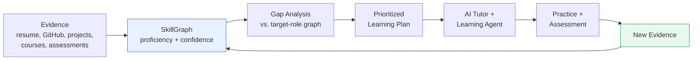

### Why GYAAN MARG vs. General AI Assistants

General-purpose assistants such as ChatGPT and Gemini are capable tools, and a student can already use them to ask about careers or learn a topic. GYAAN MARG does not compete on "being a smarter chatbot". It is a **specialized system built around structured student data**, with the language model as one component inside it.

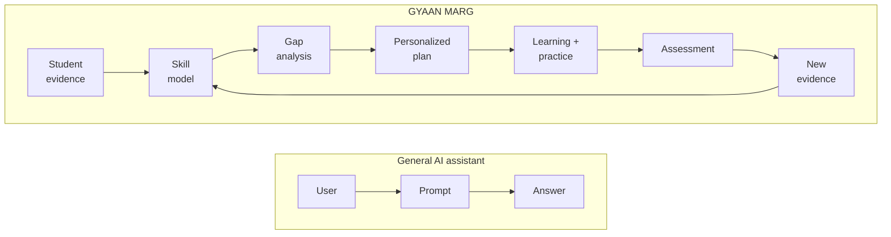

| Dimension | General AI assistant | GYAAN MARG |
|---|---|---|
| Starting point | Whatever the user types in the prompt | Structured evidence: resume, repositories, projects, assessments |
| Memory of the learner | Conversation context, possibly limited memory | Persistent, queryable SkillGraph with history |
| Skill claims | Taken at face value | Weighed against evidence; reported with a confidence score |
| Career target | Described in text each time | Explicit role graph with required skills, prerequisites, weights |
| Gap analysis | Ad hoc, varies per conversation | Deterministic comparison of graphs; the LLM only explains it |
| Learning plan | Generated once, not updated | Re-planned whenever new evidence arrives |
| Assessment | Only if the user asks | Built into the loop; results become evidence |
| Explainability | Free-text reasoning | Every recommendation links to a skill, a gap and evidence |
| Where AI sits | The product *is* the model | The model is one component inside an engineered system |

The innovation is **not the underlying LLM**. It is the system engineered around it: the SkillGraph, evidence engine, role graph, proficiency estimation, gap analysis, learning orchestration, adaptive assessment, progress engine and the continuous feedback loop.

---

## 4. Proposed Solution

GYAAN MARG ingests evidence about a student, builds a SkillGraph, compares it with a target-role graph, and runs an agentic learning process that keeps both up to date.

**Step 1: Understand the student.** Onboarding captures the target role, available time per week, preferred learning style and existing background. Evidence is added from a resume, GitHub repositories, project descriptions, courses and certifications.

**Step 2: Build the SkillGraph.** Skills are extracted and mapped to a skill ontology. Each skill gets a proficiency estimate, a confidence score and a list of supporting evidence. Skills are connected by relationships (prerequisite-of, related-to, demonstrated-by and others).

**Step 3: Compare with the target role.** A configurable role graph defines required and desirable skills, importance weights and expected competency levels. The system computes gaps and explains each one.

**Step 4: Plan.** A prerequisite-aware roadmap is created, sized to the student's available time. It is broken into weekly goals and daily tasks.

**Step 5: Teach, practice and test.** The AI tutor teaches in the context of the learner's state. Quizzes, exercises and flashcards are generated. Responses are evaluated and misconceptions are detected.

**Step 6: Close the loop.** Assessment results and completed tasks are stored as evidence. The SkillGraph is updated, gaps are recalculated, the roadmap adapts, and revision is scheduled using spaced repetition.

---

## 5. Objectives

| # | Objective | Success looks like |
|---|---|---|
| O1 | Build an **evidence-based** skill model rather than a keyword list | Each skill shows proficiency, confidence and linked evidence |
| O2 | Represent skills as a **graph** with prerequisite structure | Student can see how skills depend on each other |
| O3 | Support **configurable target-role graphs** | At least several roles available; new roles added through data, not code changes |
| O4 | Produce **explainable gap analysis** | Each gap shows current vs. target level, reason, prerequisites, confidence, priority |
| O5 | Deliver an **adaptive learning agent** that teaches, not only recommends | Tutoring, quizzes, practice and revision generated in context |
| O6 | Close the **feedback loop** | Assessments change the SkillGraph, which changes the plan |
| O7 | Use **open-source / open-weight AI** meaningfully inside the system | AI performs extraction, tutoring, assessment and explanation under structured constraints |
| O8 | Remain **feasible** for the final hackathon | Clear MVP scope, extensions and future scope separated |

---

## 6. Target Users and Use Cases

### Primary users

| User | Situation | How GYAAN MARG helps |
|---|---|---|
| **Undergraduate / diploma student** | Wants a tech career, unsure what to learn first | Shows current standing, a realistic path and weekly tasks |
| **Self-taught learner** | Has scattered skills from tutorials and projects | Turns scattered evidence into a structured skill picture |
| **Career switcher** | Has skills in one domain, targeting another | Identifies transferable skills and the true gaps |
| **Final-year student preparing for placements** | Limited time, specific role in mind | Prioritizes the highest-impact gaps and schedules revision |

### Secondary users (future scope)

Faculty, training and placement cells, mentors and institutions who want cohort-level visibility into skill readiness.

### Example use cases

- *"I know some Python and have built two small projects. I want to become a Machine Learning Engineer in eight months with ten hours a week."*
- *"I have a resume listing fifteen skills. Which ones do my GitHub repositories actually support?"*
- *"I keep forgetting what I studied three weeks ago. Remind me when to revise and test me."*
- *"My quiz showed I am weak at OOP. Change my plan."*

---

## 7. Open-Source AI Technology Selected

> [!IMPORTANT]
> **Terminology.** "Open-source" and "open-weight" are not the same. In this proposal, *open-weight* means the trained model weights are publicly downloadable under a stated license, even if training data and code are not fully released. We name the license of each component and flag when it is open-weight only. All licenses should be re-verified against the upstream repository at implementation time.

The model selections below are **proposed implementation choices**. Final choices will be validated against GYAAN MARG's own tasks in the final round (see selection criteria in Section 8). We do not cite benchmark numbers.

| Role | Proposed component | Type | License (to verify at build time) |
|---|---|---|---|
| **Primary reasoning and generation model** | **Qwen3 (small to mid-size variants, e.g. 4B / 8B / 14B)** | Open-weight LLM | Apache 2.0 for the released Qwen3 models |
| **Embedding model** | **BGE-M3** | Open-weight embedding model | MIT |
| **Reranker (optional)** | **bge-reranker-v2-m3** | Open-weight cross-encoder reranker | Apache 2.0 |
| **Local inference runtime** | **Ollama** for development; **vLLM** if a GPU server is available | Open-source inference frameworks | MIT / Apache 2.0 |
| **Vector store** | **PostgreSQL + pgvector** | Open-source database and extension | PostgreSQL License |
| **Agent orchestration** | Modular Python orchestrator; **LangGraph** optionally | Open-source framework | MIT |
| **Spaced repetition scheduling** | **FSRS algorithm** (open-source implementations) | Open-source algorithm | MIT-licensed implementations |
| **NLP utilities** | **spaCy** (optional, for pre-processing) | Open-source library | MIT |

**Fallback model options** if Qwen3 underperforms on a required task: other open-weight instruction-tuned models (for example Mistral-family or Llama-family models). Some of these use custom community licenses rather than OSI-approved ones, so they would be described as *open-weight* and their terms checked before use.

### What each AI component does

| Component | Inputs | Outputs | Interacts with |
|---|---|---|---|
| **LLM (Qwen3)** | Structured prompts with retrieved context and a required output schema | Schema-validated JSON (skills, questions, evaluations) or grounded text (explanations) | Orchestrator, Evidence Engine, Tutor, Assessment Agent |
| **Embedding model (BGE-M3)** | Resume sections, project descriptions, skill definitions, learning resource metadata | Dense vectors | pgvector, Skill Mapper, Resource Retriever |
| **Reranker** | A query and candidate passages or resources | Reordered candidates with relevance scores | Retrieval layer before LLM calls |

---

## 8. Why This Technology Was Selected

### Selection criteria

We chose components against criteria derived from GYAAN MARG's actual workload, not popularity.

| Criterion | Why it matters here |
|---|---|
| **License clarity** | The hackathon centers on open-source AI; the license must permit use and modification |
| **Structured output reliability** | Skill extraction, question generation and evaluation must return parseable, validated output |
| **Instruction following and reasoning at modest size** | The system must run on limited hardware; small and mid-size models must still handle prerequisite reasoning and explanations |
| **Multilingual capability** | Students may write resumes or ask questions in multiple Indian languages or mixed language; a multilingual model and embedder help |
| **Local / self-hosted deployment** | Student data stays under our control; no per-token cost during development |
| **Long enough context** | Resumes, repository summaries and retrieved context need to fit in one request |
| **Ecosystem support** | Good runtime and quantization support reduces integration risk during a time-boxed hackathon |

### Why open-weight AI is appropriate for GYAAN MARG

1. **Privacy.** Resumes, repositories and learning history are personal. Self-hosting lets us keep that data inside our own infrastructure instead of sending it to a third-party API.
2. **Control and reproducibility.** We can pin a model version so evaluation and skill estimates do not change unexpectedly.
3. **Customization.** Prompts, constrained decoding and, later, fine-tuning can be tailored to skill extraction and tutoring.
4. **Cost.** Learning platforms need many small model calls per student (extraction, quiz generation, evaluation, nudges). Local inference makes this affordable.
5. **Auditability.** Open components can be inspected, which matters when AI influences a student's career guidance.
6. **Fit with the hackathon theme.** The AI layer is substantive and open, not a thin wrapper around a hosted API.

### Why not a single large hosted model?

A hosted frontier model may produce stronger raw output on some tasks. However, GYAAN MARG's quality depends mostly on *structure around the model*: retrieval, constrained outputs, validation, deterministic scoring and a feedback loop. Those make a smaller open-weight model sufficient for most tasks, and let us scope model size to available hardware.

### Known limitations of the selected AI

We state these upfront because the architecture is designed around them.

| Limitation | Consequence | How the system handles it |
|---|---|---|
| Small and mid-size models can hallucinate | Incorrect explanations or invented facts | Retrieval grounding, structured outputs, validation, "answer only from provided context" prompts for factual content |
| Inconsistent JSON output | Pipeline breaks | Schema-constrained generation, validation, retry with repair prompt |
| Weaker multi-step reasoning than larger models | Roadmap logic could be wrong | Prerequisite ordering and gap math are **deterministic code over the graph**; the LLM explains and personalizes, it does not compute the plan alone |
| Multilingual quality varies | Lower quality in some languages | English first for MVP; multilingual treated as future scope |
| LLMs are poor at calibrated self-assessment | Raw model "proficiency" would be unreliable | Proficiency comes from an evidence-weighting model; the LLM only assists in *interpreting* evidence |
| Local hardware limits | Latency and model-size ceilings | Quantized models, caching, small models for simple tasks, larger model only where needed |

---

## 9. AI's Role in the System

AI is embedded at multiple points. At each point it is **bounded**: it receives structured input and returns validated output, and deterministic components make the decisions that must be consistent.

| System function | What AI does | What deterministic logic does |
|---|---|---|
| **Skill extraction** | Reads resume, project and repository text; proposes skills with supporting snippets | Maps proposed skills onto the controlled skill ontology; rejects unknown skills |
| **Semantic matching** | Embeddings link evidence text to ontology skills and resources | Similarity thresholds and reranking decide acceptance |
| **Evidence interpretation** | Judges project complexity from descriptions and repository summaries (as a labeled signal) | Weights and combines signals into proficiency and confidence |
| **Gap explanation** | Writes a natural-language reason for each gap | Computes the gap, prerequisites and priority from the graphs |
| **Roadmap personalization** | Chooses wording, examples and task framing for the student | Orders topics by prerequisite graph and time budget |
| **Tutoring** | Teaches, asks questions, explains differently after a misconception | Supplies context (skill level, history, target role) and enforces the teaching cycle |
| **Assessment generation** | Writes questions and exercises per skill and difficulty | Selects target skills and difficulty, validates the format |
| **Response evaluation** | Evaluates open responses against a rubric; flags misconceptions | Scores objective questions automatically; stores results |
| **Revision and nudges** | Generates flashcards and short, contextual reminders | FSRS-style scheduler decides *when* to review |
| **Agent orchestration** | Helps choose the next action in ambiguous cases | Workflow state machine defines allowed transitions |

**Principle:** *the LLM proposes and explains; the engine decides and records.* This keeps the system explainable and limits the effect of model errors.

### AI/model interaction flow

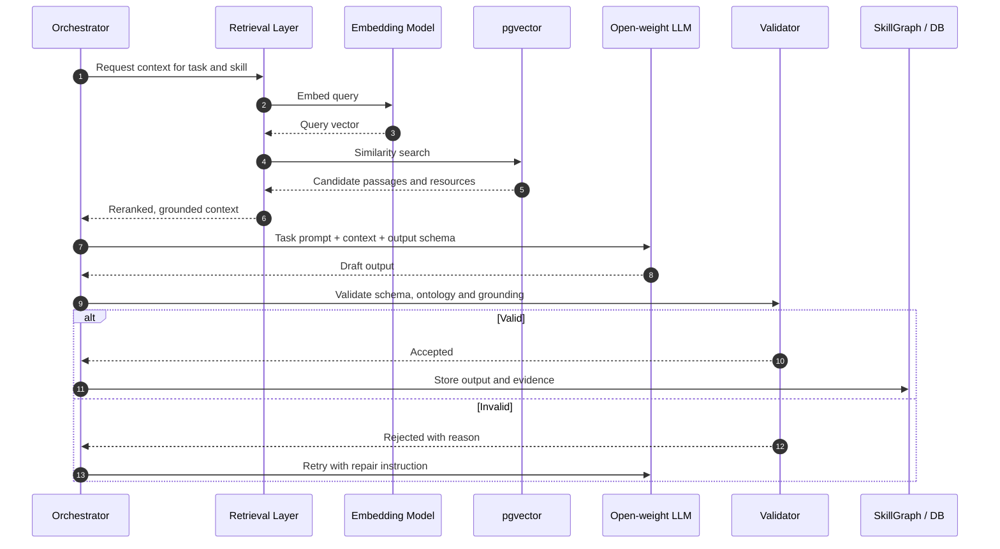

---

## Core Concepts

### SkillGraph

The SkillGraph is a per-student graph. **Nodes** are skills from a controlled ontology. **Edges** are typed relationships. Each node carries estimates and evidence.

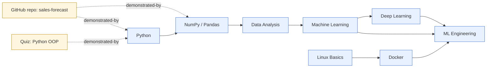

**Relationship types**

| Relationship | Meaning | Example |
|---|---|---|
| `prerequisite-of` | Should be learned before | Python → NumPy |
| `required-for` | Needed for a role or higher-level skill | Docker → ML Engineering |
| `related-to` | Overlaps or complements | Pandas ↔ SQL |
| `demonstrated-by` | Evidence supports the skill | Repository → Python |
| `used-by` | Skill is applied in a project or tool | NumPy → forecasting project |

### Evidence-based proficiency and confidence

A student writing "I know Python" does **not** automatically produce a high Python score. Self-reported claims are treated as *weak evidence*. Stronger evidence moves the estimate more.

**Two separate quantities are tracked for every skill:**

| Quantity | Meaning | Question it answers |
|---|---|---|
| **Proficiency** | Estimated current ability | "How good is the student at this?" |
| **Confidence** | How strong and consistent the supporting evidence is | "How sure are we about that estimate?" |

**Illustrative example (not real data):**

| Skill | Proficiency | Confidence | Interpretation |
|---|---|---|---|
| Python | 75% | 88% | Multiple strong, consistent sources; trust the estimate |
| Docker | 20% | 35% | One weak signal; likely low, but the system should test to find out |
| SQL | 60% | 30% | Claimed and listed in a course, but little demonstrated work; confirm with an assessment |

**Evidence signals considered**

| Evidence source | Typical strength | Notes |
|---|---|---|
| Self-reported skill | Weak | Useful as a starting hypothesis |
| Resume mention | Weak to moderate | Higher if tied to a described project |
| Course or certification | Moderate | Depends on assessed vs. attendance-only |
| GitHub repository / project | Moderate to strong | Considers size, recency, complexity signals and whether the student authored it |
| Coding platform activity | Moderate | Optional integration |
| Platform quiz / assessment | Strong | Directly measured, per sub-skill |
| Completed learning task with evaluation | Moderate to strong | Recorded by the Progress Agent |

**Estimation approach (conceptual).** Each piece of evidence contributes a signal weighted by source reliability, recency and relevance. Proficiency combines signals; confidence rises with the number, diversity and agreement of independent sources, and falls when evidence conflicts or ages. Proficiency estimation is an **evidence-based estimate with uncertainty, not an objective measurement**. The interface shows confidence next to every score and lets the student see and challenge the evidence.

### Target-role graph

A role is also a graph, defined as data so roles can be added or edited without code changes.

| Role graph element | Description |
|---|---|
| Required skills | Skills expected for the role |
| Desirable skills | Valued but not essential |
| Prerequisite relationships | Ordering between skills |
| Relative importance | Weight of each skill for the role |
| Competency expectation | Target proficiency level per skill |

Supported example roles: Software Engineer, Data Scientist, Machine Learning Engineer, AI Engineer, Web Developer, Cybersecurity Engineer, Data Analyst, and further configurable roles. Role definitions are seeded from open occupational and skills references (candidates include ESCO and O*NET, subject to license verification) and curated by us.

### Gap analysis

Gap analysis is a **graph comparison**, followed by an AI-written explanation. Output for a single gap looks like this (illustrative):

| Field | Example |
|---|---|
| Skill | Docker |
| Current proficiency | 20% |
| Target expectation | 65% |
| Confidence in current estimate | Low (35%) |
| Priority | **High** |
| Why it matters | Required for deployment workflows relevant to the selected role |
| Prerequisite chain | Linux fundamentals → networking basics → Docker |
| Evidence | One course mention; no project usage |
| Suggested next action | Short diagnostic quiz on Linux basics, then begin Docker module |

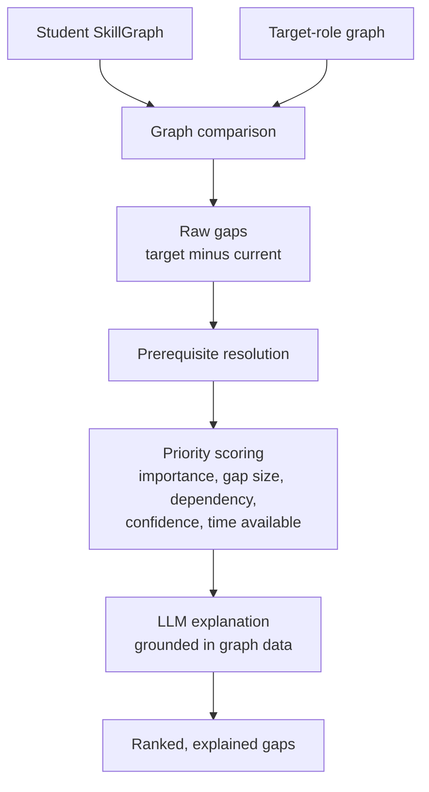

Priority combines role importance, size of the gap, how many other skills depend on it, how uncertain the current estimate is, and the student's available time. Low-confidence gaps trigger a **diagnostic assessment** before a long learning commitment.

### The closed learning loop

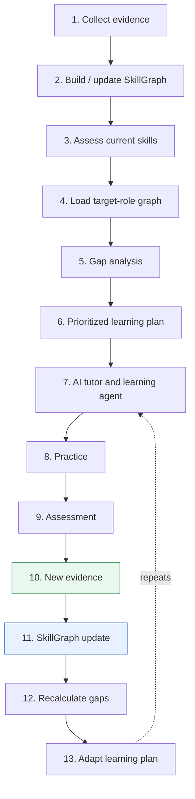

The loop means the model of the student is never final. It evolves with every quiz, task and project.

---

## 10. System Architecture

GYAAN MARG is organized in three intelligence layers behind a web interface and API, sitting on a shared data layer and an open-weight AI services layer.

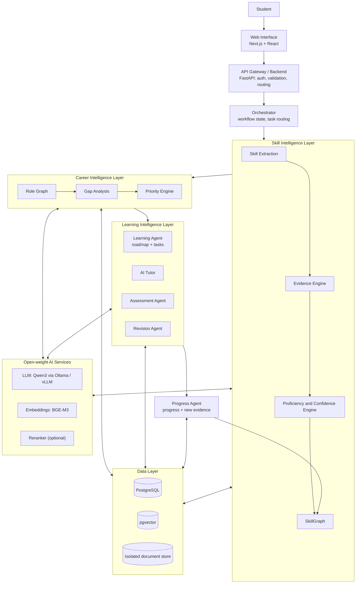

**Design principles**

1. **Layered intelligence.** Skill, career and learning concerns are separated so each can be improved independently.
2. **Deterministic core, probabilistic edges.** Graph logic, scoring and scheduling are deterministic; the LLM handles language-heavy tasks inside validated boundaries.
3. **Evidence as the single source of truth.** Every estimate traces back to stored evidence.
4. **Everything writes back.** Learning activity always produces evidence records, which makes the loop possible.

---

## 11. Component-Level Architecture

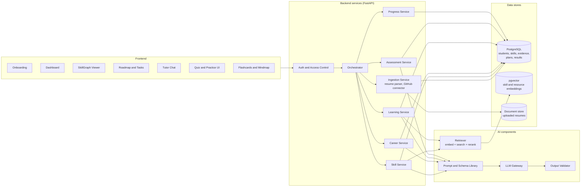

| Component | Responsibility |
|---|---|
| **Ingestion Service** | Parses resumes, calls GitHub API with user consent, normalizes project text and metadata |
| **Skill Service** | Extraction, ontology mapping, evidence linking, proficiency and confidence computation |
| **Career Service** | Loads role graphs, runs gap analysis and priority scoring |
| **Learning Service** | Builds roadmaps, daily and weekly tasks, selects learning resources, runs tutor sessions |
| **Assessment Service** | Generates and evaluates questions, produces assessment evidence |
| **Progress Service** | Records progress, updates the SkillGraph, computes readiness and risk indicators |
| **Orchestrator** | Decides the next action and enforces allowed workflow transitions |
| **LLM Gateway** | Single entry point to the open-weight model; handles prompts, retries and logging |
| **Output Validator** | Enforces output schemas, checks skills against the ontology, checks grounding |
| **Retriever** | Embeds queries, searches pgvector, reranks candidates |

---

## 12. Data and Information Flow

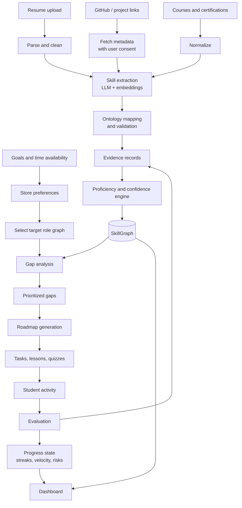

**Key data transformations**

| Stage | Input | Output |
|---|---|---|
| Ingestion | Raw resume, repository metadata, course data | Cleaned, structured text segments |
| Extraction | Segments | Candidate skills with supporting snippets |
| Mapping | Candidate skills | Ontology-aligned skill IDs |
| Evidence storage | Mapped skills + source | Evidence records with source type, strength, timestamp |
| Estimation | Evidence records per skill | Proficiency + confidence per skill |
| Gap analysis | SkillGraph + role graph | Ranked gaps with reasons |
| Planning | Ranked gaps + time budget | Weekly roadmap and daily tasks |
| Assessment | Student responses | Scores, misconceptions, new evidence |
| Update | New evidence | Updated SkillGraph, recalculated gaps, adapted plan |

---

## 13. Agentic Workflow

GYAAN MARG is designed as a modular multi-agent system with an orchestrator. Agents are bounded: each has defined inputs, outputs and tools, and the orchestrator controls which transitions are allowed.

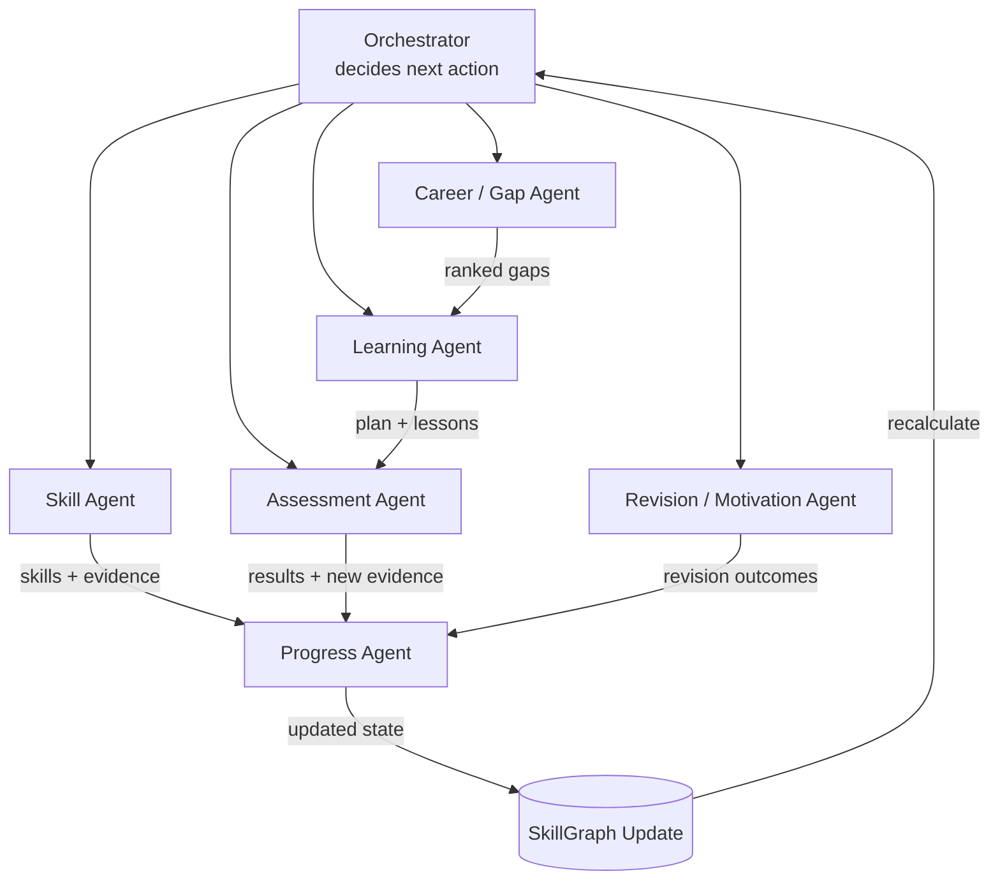

### Agent responsibilities

| Agent | Responsibilities | Tier |
|---|---|---|
| **Skill Agent** | Extracts skills, maps evidence to skills, estimates proficiency and confidence | **Core MVP** |
| **Career / Gap Agent** | Compares SkillGraph with role graph, prioritizes gaps, reasons about prerequisites | **Core MVP** |
| **Learning Agent** (with Tutor) | Builds the roadmap, selects activities, teaches concepts, adapts content | **Core MVP** |
| **Assessment Agent** | Generates assessments, evaluates responses, detects weaknesses, produces evidence | **Core MVP** |
| **Progress Agent** | Updates learning state and SkillGraph, recalculates readiness | **Core MVP** |
| **Revision / Motivation Agent** | Spaced revision scheduling, flashcards, contextual nudges, consistency tracking | **Extension** (basic revision in MVP; nudges and risk detection as extension) |
| **Orchestrator** | Coordinates agents, enforces workflow boundaries | **Core MVP** |

> [!NOTE]
> We do not claim that every agent will be independently implemented as a separate autonomous process in the final round. In the MVP, agents can be modules with clear interfaces coordinated by a single orchestrator. The architecture allows them to be separated later.

### The AI Tutor loop

The tutor is not a static question-answer chatbot. It follows a teaching cycle and carries the student's context.

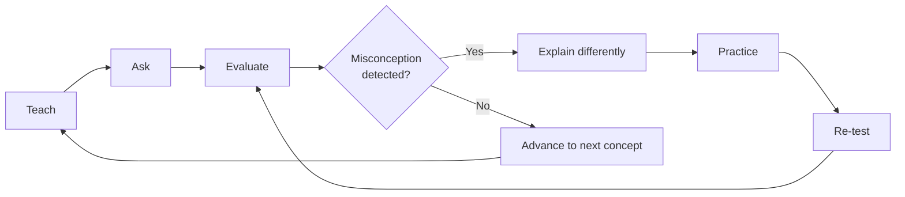

**Context passed to the tutor on every session**

| Context | Used for |
|---|---|
| Current skill level and confidence | Choosing starting depth and pace |
| Learning history | Avoiding repetition, referencing earlier material |
| Current roadmap position | Staying on the planned topic |
| Previous mistakes and misconceptions | Targeting weak spots, rewording explanations |
| Target role | Choosing relevant examples |
| Prerequisite graph | Detecting that a *prerequisite* is the real problem |

**Guardrails.** For factual explanations, the tutor is grounded on retrieved learning material. Generated quiz questions are validated for format and answer consistency before being shown.

### Adaptive assessment

Assessments are periodic and skill-targeted. They test sub-skills so the system can find *where* inside a skill the weakness lies.

**Illustrative example (not real data):**

| Python sub-skill | Score |
|---|---|
| Syntax | 90% |
| Functions | 82% |
| **OOP** | **51%** |
| Libraries | 74% |

The system identifies OOP as the weakness, lowers confidence in the related evidence, inserts OOP remediation into the roadmap, and schedules a re-test. The assessment result is stored as **new, strong evidence**, which updates the SkillGraph.

### User journey

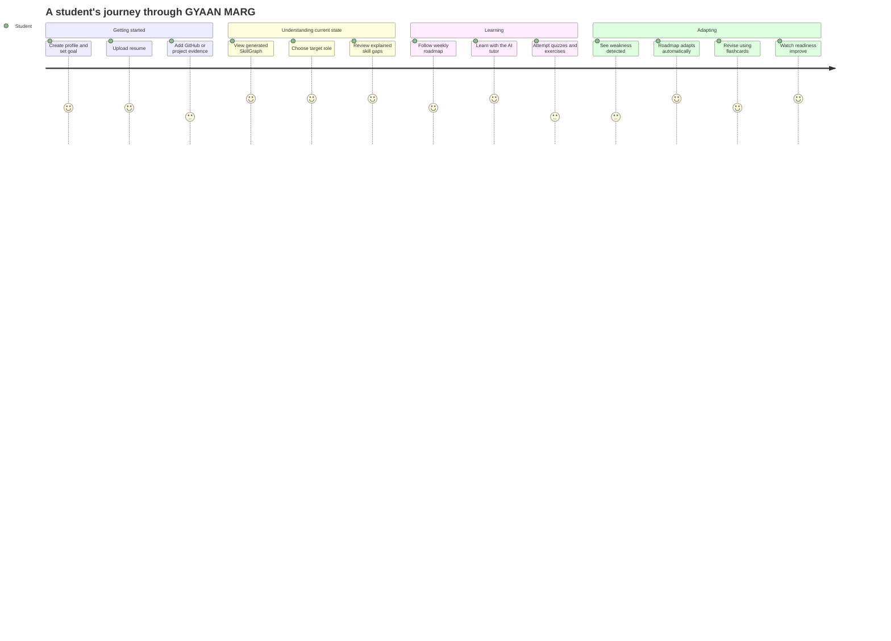

---

## Conceptual Data Model

Conceptual only; no schema or code is included in this repository.

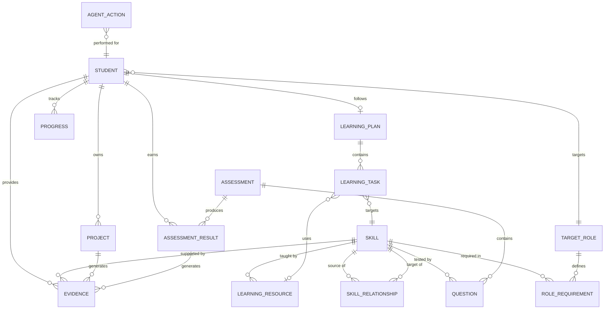

| Entity | Description |
|---|---|
| **Student** | Account, goals, available time, preferences |
| **Skill** | A node in the controlled skill ontology |
| **SkillRelationship** | Typed edge between skills (prerequisite-of, related-to, etc.) |
| **Evidence** | A unit of support for a skill: source type, strength, timestamp, linked artifact |
| **Project** | Student project or repository with summary metadata |
| **Assessment / Question / AssessmentResult** | Tests, their items, and the student's outcomes |
| **TargetRole / RoleRequirement** | Role definition and per-skill expectations and weights |
| **LearningResource** | Course, article, video or exercise metadata mapped to skills |
| **LearningPlan / LearningTask** | The roadmap and its daily and weekly tasks |
| **Progress** | Streaks, completion, velocity, revision state, risk indicators |
| **AgentAction** | Log of agent decisions and tool use, supporting explainability and debugging |

---

## 14. Technology Stack

Each technology is included for a reason. We avoided adding tools without a clear need.

| Layer | Technology | Why it is used |
|---|---|---|
| **Frontend framework** | Next.js + React | Component-based UI, good routing and developer experience |
| **Styling** | Tailwind CSS | Fast, consistent styling during a time-limited build |
| **Graph visualization** | React Flow (primary candidate); D3 or Cytoscape.js as alternatives | The SkillGraph and roadmap must be visible, interactive and explorable |
| **Charts** | A lightweight open-source chart library | Dashboard metrics and skill progress |
| **Backend** | Python + FastAPI | Python ecosystem for AI work; typed, async-friendly API layer |
| **Data validation** | Pydantic | Defines and enforces structured schemas for LLM output and API payloads |
| **Database** | PostgreSQL | Reliable relational store for students, evidence, plans and results |
| **Vector search** | pgvector (PostgreSQL extension) | Semantic retrieval without running a separate vector database |
| **ORM / migrations** | SQLAlchemy + Alembic | Maintainable data access and schema evolution |
| **LLM** | Qwen3 (open-weight, Apache 2.0) | Reasoning, extraction, tutoring and assessment (Section 7) |
| **Embeddings** | BGE-M3 | Semantic matching of evidence to skills and resources |
| **Reranker** | bge-reranker-v2-m3 (optional) | Improves retrieval precision before generation |
| **Inference runtime** | Ollama (dev) / vLLM (GPU server) | Local serving of open-weight models |
| **Agent layer** | Modular Python orchestration; LangGraph optional | Explicit, inspectable workflow state; framework only if it reduces complexity |
| **Spaced repetition** | FSRS-based scheduling | Forgetting-aware review scheduling |
| **Document processing** | pypdf / pdfplumber, python-docx | Resume parsing under permissive licenses |
| **Integrations** | GitHub REST API; optional coding-platform evidence; learning resource metadata | Evidence from real work |
| **Containerization** | Docker + Docker Compose (final round) | Reproducible local and demo environment |

**Deliberately not included:** a separate vector database, message brokers and microservice meshes. For the hackathon scope, PostgreSQL with pgvector and a modular monolith are simpler and sufficient.

---

## 15. Expected Features

### Feature tiers

| Tier | Meaning |
|---|---|
| **Core MVP** | Must work end to end in the final-round demo |
| **Strong extension** | Built if time allows after the core loop works |
| **Future scope** | Designed for, not built in the hackathon |

### Feature table

| # | Feature | Description | Tier |
|---|---|---|---|
| 1 | Personalized onboarding | Collects goal, time budget, background | Core MVP |
| 2 | Goal / intent understanding | Interprets free-text goals into role and constraints | Core MVP |
| 3 | Current knowledge assessment | Quick diagnostic quizzes for low-confidence skills | Core MVP |
| 4 | SkillGraph generation | Graph with proficiency, confidence, evidence | Core MVP |
| 5 | Career target selection | Choose from supported roles | Core MVP |
| 6 | Role-specific skill mapping | Role graphs as data | Core MVP |
| 7 | Skill gap detection | Graph comparison with explanations | Core MVP |
| 8 | Gap prioritization | Importance, dependency, confidence, time | Core MVP |
| 9 | Prerequisite-aware roadmap | Ordered by the prerequisite graph | Core MVP |
| 10 | Personalized weekly roadmap | Fits available time | Core MVP |
| 11 | Daily learning plan | Concrete tasks per day | Core MVP |
| 12 | AI tutoring | Context-aware teaching cycle | Core MVP |
| 13 | Adaptive explanations | Re-explains after misconceptions | Core MVP |
| 14 | Quiz generation | Skill-targeted question sets | Core MVP |
| 15 | Adaptive assessments | Difficulty and focus adjust to results | Core MVP |
| 16 | Coding / technical practice | Exercises with rubric-based evaluation | Strong extension |
| 17 | Flashcards | Generated from learned content | Strong extension |
| 18 | Spaced revision | FSRS-style review schedule | Strong extension |
| 19 | Mindmap generation | Topic mindmaps from content | Strong extension |
| 20 | In-course revision | Revision during a module | Strong extension |
| 21 | Task management | Complete, defer, reschedule tasks | Core MVP |
| 22 | Learning reminders | Contextual nudges | Strong extension |
| 23 | Progress dashboard | Readiness, strengths, gaps, streaks | Core MVP |
| 24 | Skill progress visualization | Before/after view of the SkillGraph | Core MVP |
| 25 | Career readiness indicator | Aggregate match against target role | Core MVP |
| 26 | Learning risk detection | Flags drop-off or stalled progress | Strong extension |
| 27 | Evidence tracking | Every estimate links to its evidence | Core MVP |
| 28 | Continuous SkillGraph updates | Closed loop | Core MVP |
| 29 | Learning history | Past sessions, results and mistakes | Core MVP |
| 30 | Explainable recommendations | "Why this, why now" on every recommendation | Core MVP |

### Dashboard concept

| Panel | Shows |
|---|---|
| Career readiness | Overall match to target-role graph |
| Skills: current vs. target | Per-skill comparison |
| Top strengths / top gaps | Highest and lowest relative to role |
| Skill confidence | Where estimates are uncertain |
| Roadmap progress | Completed vs. planned tasks |
| Assessment performance | Recent results and trends |
| Learning streak and velocity | Consistency and pace |
| Revision status | Items due and overdue |
| Risk indicators | Stalled skills, missed sessions, widening gaps |

All figures shown in this proposal are illustrative examples, not real-world results.

---

## 16. Implementation Approach

The final hackathon will be built in phases. Each phase delivers something demonstrable. Later phases depend on earlier ones, so the order follows the closed loop.

```mermaid
gantt
    title Final-round build plan (relative order)
    dateFormat  X
    axisFormat  %s
    section Foundation
    Phase 1 Foundation            :p1, 0, 2
    section Intelligence
    Phase 2 Skill intelligence    :p2, 2, 4
    Phase 3 Career intelligence   :p3, 4, 6
    section Learning
    Phase 4 Learning agent        :p4, 6, 8
    Phase 5 Assessment            :p5, 8, 10
    section Integration
    Phase 6 Closed loop           :p6, 10, 12
    Phase 7 Dashboard and demo    :p7, 12, 14
```

> The Gantt chart shows sequence and rough proportion only. Exact scheduling will depend on the final-round time window.

| Phase | Focus | Deliverables |
|---|---|---|
| **1. Foundation** | Frontend, backend, database, user profile, basic skill ontology | Running app skeleton, authentication, initial ontology of core skills for the supported roles |
| **2. Skill intelligence** | Resume ingestion, GitHub / project evidence, extraction, proficiency and confidence, SkillGraph | Student can upload a resume and add evidence; sees a SkillGraph with scores, confidence and evidence |
| **3. Career intelligence** | Role graphs, gap analysis, prioritization | Role graphs for a small set of roles; explained, ranked gaps |
| **4. Learning agent** | Roadmap, tutoring, resource retrieval, tasks | Weekly and daily plan; tutor sessions grounded in resources |
| **5. Assessment** | Quizzes, adaptive assessment, evidence generation | Sub-skill assessments with stored results |
| **6. Closed loop** | SkillGraph update, gap recalculation, roadmap adaptation | Assessment changes SkillGraph; plan updates visibly |
| **7. Dashboard, demo, deployment** | Dashboard, polish, demo data, deployment | End-to-end demo; containerized setup |

### Engineering practices

- **Schema-first AI calls:** every LLM task has a defined output schema and validator.
- **Prompt and schema library:** versioned and tested with a small set of fixed example inputs.
- **Small evaluation set:** a few hand-checked resumes and sample projects to sanity-check extraction quality. No accuracy claims are made in this proposal.
- **Graceful degradation:** if the model fails validation after retries, the system falls back to showing evidence-only results rather than invented output.
- **Seeded demo data:** curated role graphs and learning resource metadata so the demo does not depend on live web content.

### Scope control

The MVP concentrates on a small number of roles, a focused ontology, and one deep end-to-end loop. We prefer a complete, believable loop for a few roles to shallow coverage of many.

---

## 17. Expected Final Output

At the end of the final round, GYAAN MARG will be a working, demonstrable web application.

### Expected demo

1. Student creates a profile and sets goals.
2. Student uploads a resume.
3. System extracts skills.
4. Student connects or adds GitHub and project evidence.
5. SkillGraph is generated with proficiency, confidence and evidence.
6. Student selects a target role.
7. Role graph is loaded.
8. System compares the student's SkillGraph with the role graph.
9. Skill gaps appear with explanations.
10. Gaps are prioritized.
11. Learning Agent creates a prerequisite-aware roadmap.
12. Student starts learning a topic.
13. AI Tutor teaches in context.
14. Student takes an assessment.
15. Assessment reveals a weak sub-skill.
16. Agent adapts the roadmap.
17. New evidence updates the SkillGraph.
18. Career readiness changes on the dashboard.

Steps 14 to 18 show the closed loop: *assessment → evidence → SkillGraph update → gap recalculation → plan adaptation*.

### Expected deliverables

| Deliverable | Description |
|---|---|
| Web application | Frontend, backend and database running together |
| SkillGraph module | Evidence ingestion, estimation, graph visualization |
| Role and gap engine | Configurable role graphs and explainable gap analysis |
| Learning agent | Roadmap, tutor, tasks |
| Assessment engine | Generated quizzes with evaluation |
| Closed-loop updater | Automatic graph and plan updates |
| Dashboard | Readiness and progress view |
| Documentation | Updated README, architecture, setup instructions |
| Demo | Prepared walkthrough with sample data |

---

## 18. Future Scope and Scalability

### Scaling path

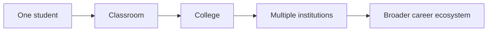

| Stage | What changes | Architectural implication |
|---|---|---|
| **One student** | Single SkillGraph and learning agent | Modular monolith with local inference |
| **Classroom** | Instructor view of a group | Role-based access control; aggregated views |
| **College** | Hundreds to thousands of learners | Background job queue, batch inference, inference server (vLLM) with GPU, caching |
| **Multiple institutions** | Tenancy, data isolation, per-institution roles | Multi-tenant data model, per-tenant configuration, audit logs |
| **Career ecosystem** | Skill data shared with consent across stakeholders | Verified skill profiles, interoperability standards, privacy-preserving analytics |

### Future capabilities (not part of the final-round MVP)

| Area | Capability |
|---|---|
| **Institutions** | Institution dashboards; anonymized cohort skill analytics |
| **Hiring ecosystem** | Recruiter-facing verified skill profiles (student-controlled sharing) |
| **Role intelligence** | Industry skill trend detection; dynamic role graphs updated from job-market data |
| **Agents** | Additional specialist agents (project mentor, interview preparation, career counselor) |
| **Language and modality** | Multilingual learning; voice tutor; multimodal learning (diagrams, video) |
| **Platform** | Mobile application; offline / on-device inference with small models |
| **Social learning** | Peer learning and study groups; mentor integration |
| **Model improvement** | Fine-tuning on curated skill extraction and tutoring data (with consent and licensing review) |

---

## 19. Open-Source Dependencies and Components

> Licenses are listed to the best of our current knowledge and will be re-verified when the dependency versions are fixed in the final round.

| Component | Purpose | License (expected) |
|---|---|---|
| **Qwen3** | Primary open-weight LLM | Apache 2.0 (open-weight) |
| **BGE-M3** | Embedding model | MIT (open-weight) |
| **bge-reranker-v2-m3** | Optional reranker | Apache 2.0 (open-weight) |
| **Ollama** | Local model serving (development) | MIT |
| **vLLM** | High-throughput model serving (GPU) | Apache 2.0 |
| **PostgreSQL** | Primary database | PostgreSQL License |
| **pgvector** | Vector similarity search | PostgreSQL License |
| **FastAPI** | Backend framework | MIT |
| **Pydantic** | Schema validation | MIT |
| **SQLAlchemy / Alembic** | Data access and migrations | MIT |
| **LangGraph** (optional) | Agent workflow graphs | MIT |
| **spaCy** (optional) | NLP pre-processing | MIT |
| **pypdf / pdfplumber / python-docx** | Resume parsing | BSD / MIT |
| **FSRS implementations** | Spaced repetition scheduling | MIT |
| **Next.js / React** | Frontend | MIT |
| **Tailwind CSS** | Styling | MIT |
| **React Flow** (or D3 / Cytoscape.js) | Graph visualization | MIT / ISC / MIT |
| **Docker / Docker Compose** | Packaging | Apache 2.0 |
| **ESCO, O*NET** (candidate references) | Seed material for skill and role ontologies | Open data terms; to be verified |

---

## 20. Expected Challenges and Mitigation

| Challenge | Why it matters | Mitigation |
|---|---|---|
| **Inaccurate skill extraction** | Wrong skills corrupt the SkillGraph | Controlled ontology; reject unmapped skills; evidence snippets shown to the student; student can correct entries |
| **Unreliable self-reported information** | Students may over- or under-state ability | Evidence-first design: self-reports are weak signals that need corroboration or assessment |
| **Sparse evidence** | New students have little to analyze | Confidence score reflects sparsity; diagnostic quizzes generate evidence quickly |
| **Hallucination** | Incorrect tutoring harms learning | Retrieval grounding, structured outputs, validation, "use provided context only" for factual content |
| **Proficiency estimation uncertainty** | Scores can mislead | Proficiency shown with confidence; multiple evidence sources; assessments; explicit statement that it is an estimate |
| **Changing job requirements** | Role graphs become outdated | Role definitions as editable data; versioned; future trend detection |
| **Noisy GitHub / project evidence** | Forked, copied or trivial repos inflate scores | Authorship and activity checks; down-weight forks and boilerplate; project evidence cross-checked by assessments |
| **LLM reasoning errors** | Wrong gap logic or plan | Deterministic graph logic for gaps and ordering; LLM explains rather than decides |
| **Assessment quality** | Poor questions give poor evidence | Schema and consistency validation; rubric-based evaluation; question quality flags; human-curated seed questions for core skills |
| **Privacy and security** | Personal data is sensitive | Minimal data collection, secure storage, user control (see below) |
| **Resource quality** | Bad learning resources waste time | Curated resource metadata; ranking by relevance and quality signals; student feedback |
| **Computational constraints** | Local models need hardware | Quantized models, model-size tiers by task, caching, batching, fallback to smaller models |
| **Agent coordination** | Multi-agent systems drift or loop | Orchestrator with explicit state machine, bounded steps, action logging, human override |
| **Scalability** | More users means more inference | Stateless services, job queue, inference server with batching, caching of repeated content |
| **Student disengagement** | Plans fail if students drop off | Realistic time-based plans, small daily tasks, contextual nudges, risk detection |

---

## Security and Privacy

GYAAN MARG handles resumes, repository metadata and learning history. These are personal data, and the design treats them accordingly.

| Area | Approach |
|---|---|
| **Authentication** | Secure authentication with hashed credentials and session or token management |
| **Authorization** | Students can access only their own data; role-based access for future instructor views |
| **Encryption in transit** | HTTPS/TLS for all client and service traffic |
| **Protected personal data** | Sensitive fields protected at rest where appropriate; access limited by role |
| **Minimal data collection** | Collect only what is needed to estimate skills and plan learning |
| **User-controlled integrations** | GitHub and other connections are opt-in, scoped to minimum permissions, and revocable |
| **API credential protection** | Secrets stored in environment configuration or a secrets manager, never in the repository |
| **Document isolation** | Uploaded resumes stored separately from application data, with restricted access |
| **GitHub data handling** | Only repository metadata and public or user-authorized content needed for evidence is read; private content is not accessed without explicit consent |
| **Local inference** | Prompts containing student data are processed by self-hosted models rather than sent to third-party AI APIs |
| **User control** | Students can view the evidence behind their SkillGraph, correct it, and request deletion of their data |

> [!NOTE]
> This section describes design intentions for the final implementation. We make no claims of regulatory compliance or certification.

---

## Summary

GYAAN MARG treats career guidance and learning as one continuous process instead of three separate tools for assessment, planning and teaching. Its core is an **evidence-based SkillGraph**, a **configurable role graph**, **explainable gap analysis**, and an **AI learning agent** that teaches, tests and revises, with every learning activity feeding evidence back into the model of the student.

Open-weight AI is used inside this system for extraction, semantic matching, tutoring, assessment and explanation, with deterministic components and validation around it. The proposal is ambitious in design and deliberately scoped in implementation: a focused MVP that demonstrates the complete closed loop, with a clear path to extensions and larger scale.

---

*GYAAN MARG: Team Expedition Zero*
