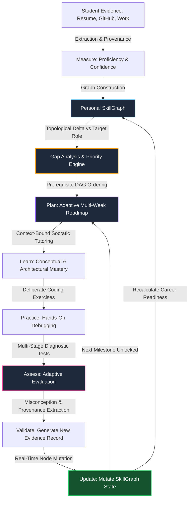
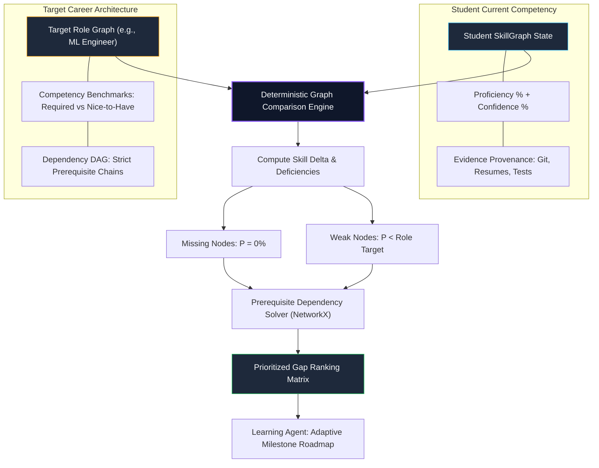
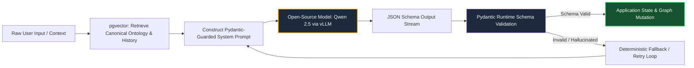
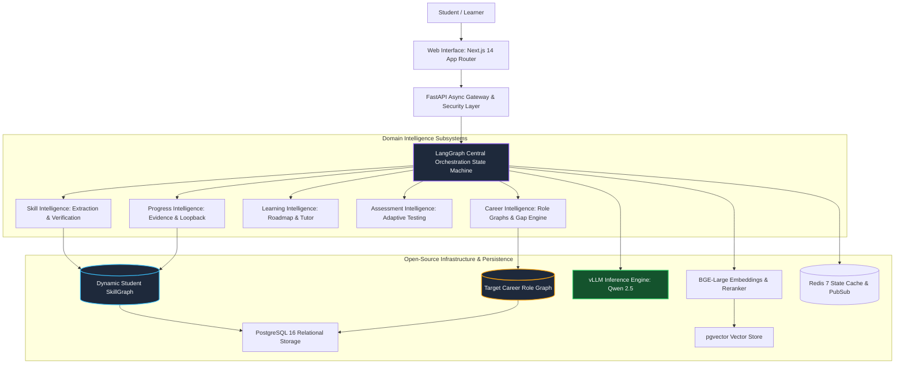
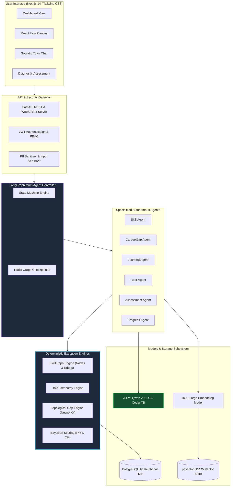
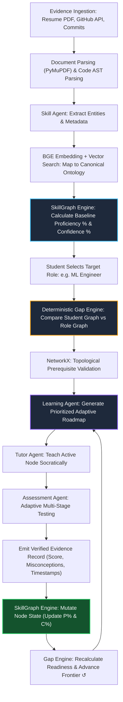
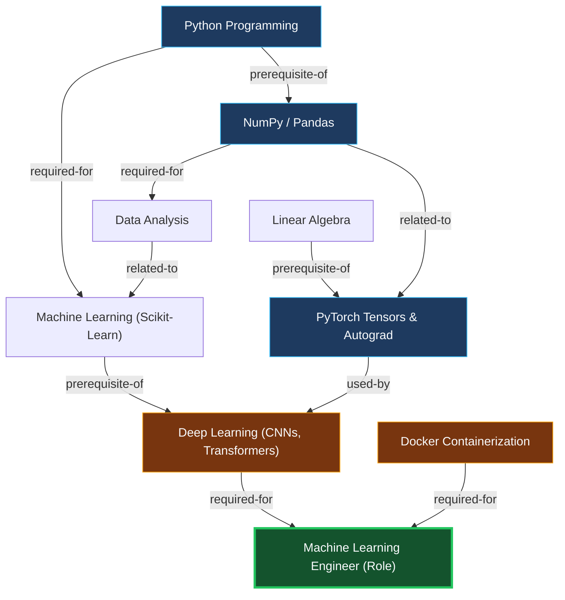

# GYAAN MARG (ज्ञान मार्ग)
### *AI-Powered Career Intelligence & Closed-Loop Personal Learning System*

---

> ### **Core System Positioning**
> **GYAAN MARG is not another AI chatbot.** It is a closed-loop career intelligence and personal learning system that builds an evidence-based model of a student's skills, compares it against a target career, identifies prioritized gaps, and uses an adaptive AI learning agent to close those gaps and continuously verify progress.

```
       [ Where am I? ]                   [ Where do I need to go? ]
  Evidence-Based SkillGraph              Target-Role Competency Graph
             │                                       │
             └───────────────────┬───────────────────┘
                                 ▼
                     [ What is the difference? ]
                      Deterministic Gap Engine
                                 │
                                 ▼
                        [ How do I get there? ]
                     Multi-Agent Learning System
                                 │
                                 ▼
                     [ Did I actually improve? ]
                    Adaptive Assessment & Evidence
                                 │
                                 ▼
               [ Continuous SkillGraph Update Loop ↺ ]
```

---

## Table of Contents

- [1. Project Name](#1-project-name)
- [2. Problem Statement](#2-problem-statement)
- [3. Project Overview](#3-project-overview)
- [4. Proposed Solution](#4-proposed-solution)
- [5. Objectives](#5-objectives)
- [6. Target Users / Use Cases](#6-target-users--use-cases)
- [7. Open-Source AI Technology Selected](#7-open-source-ai-technology-selected)
- [8. Why This Technology Was Selected](#8-why-this-technology-was-selected)
- [9. AI's Role in the System](#9-ais-role-in-the-system)
- [10. System Architecture](#10-system-architecture)
- [11. Component-Level Architecture](#11-component-level-architecture)
- [12. Data / Information Flow](#12-data--information-flow)
- [13. Agentic Workflow](#13-agentic-workflow)
- [14. Technology Stack](#14-technology-stack)
- [15. Expected Features & Scope Classification](#15-expected-features--scope-classification)
- [16. Implementation Approach](#16-implementation-approach)
- [17. Expected Final Output & Judge-Facing Demo](#17-expected-final-output--judge-facing-demo)
- [18. Future Scope / Scalability](#18-future-scope--scalability)
- [19. Open-Source Dependencies / Components](#19-open-source-dependencies--components)
- [20. Expected Challenges and Mitigation](#20-expected-challenges-and-mitigation)
- [21. Conceptual Data Model](#21-conceptual-data-model)
- [22. Deep Architectural Deep-Dives](#22-deep-architectural-deep-dives)
  - [22.1 The Mathematics of Proficiency vs. Confidence](#221-the-mathematics-of-proficiency-vs-confidence)
  - [22.2 Topological Prerequisite Traversal (DAG Theory)](#222-topological-prerequisite-traversal-dag-theory)
  - [22.3 Differentiation from General-Purpose LLMs (ChatGPT / Gemini / Claude)](#223-differentiation-from-general-purpose-llms-chatgpt--gemini--claude)
  - [22.4 The Socratic AI Tutor Pedagogical Model](#224-the-socratic-ai-tutor-pedagogical-model)
  - [22.5 Adaptive Assessment & Diagnostic Rubrics](#225-adaptive-assessment--diagnostic-rubrics)
- [23. Security, Privacy & Data Governance](#23-security-privacy--data-governance)
- [24. Qualifier Compliance & Verification Checklist](#24-qualifier-compliance--verification-checklist)

---

## 1. Project Name

**Project Name:** `GYAAN MARG` (Sanskrit: ज्ञान मार्ग — *The Path of Knowledge & Discernment*)  
**System Class:** Evidence-Engineered Career Intelligence + Closed-Loop Multi-Agent Learning Orchestrator  
**Repository Composition:** Technical Proposal Specification (`README.md` only qualifier deliverable)

---

## 2. Problem Statement

Modern technical education, career preparation, and self-directed upskilling suffer from five fundamental structural failures:

### 2.1 The "Illusion of Competence" in Modern EdTech
Most learners confuse **content consumption** with **skill acquisition**. Watching a 40-hour video playlist on machine learning or copying code from a tutorial gives students an illusion of mastery ("Tutorial Hell"). Current platforms reward passive completion certificates rather than verifying whether the learner can independently reason, debug, and build.

### 2.2 The Disconnect Between Academics and Industry Role Requirements
Colleges teach abstract, siloed topics that lag industry tools by 3 to 7 years. Conversely, job descriptions list laundry lists of requirements (e.g., Docker, Kubernetes, CI/CD, vector search, PyTorch) without indicating the **topological dependencies** or the **minimum required competency**. Students are paralyzed: they know they want to become an "AI Engineer" or "Backend Architect", but they have no analytical mechanism to calculate their exact delta.

### 2.3 Resume Keyword Inflation vs. Verifiable Proof
Job seekers inflate their resumes with buzzwords, while recruiters spend seconds scanning them using primitive ATS keyword matchers. Neither side possesses an **evidence-backed, bi-dimensional graph** that separates what a student *claims* from what their projects, code commits, and diagnostic evaluations *actually substantiate*.

### 2.4 The Failure of General-Purpose AI Chatbots in Education
When students ask generic LLMs (ChatGPT, Claude, Gemini) for guidance:
- The chatbot generates **stateless, linear, one-shot roadmaps** that do not account for the student’s actual code or real knowledge boundaries.
- The chatbot possesses **no persistent skill state**. If a student spends 3 days mastering SQL joins, the chatbot forgets this in the next session unless reminded.
- The chatbot **does not evaluate learning retention or update an underlying competence graph**.
- The interaction is open-ended conversation rather than a structured pedagogical loop.

### 2.5 Summary Problem Matrix
| Educational Axis | Conventional Platforms (Coursera, Udemy) | General AI Chatbots (ChatGPT, Gemini) | The Critical Need (GYAAN MARG) |
| :--- | :--- | :--- | :--- |
| **Skill State** | Flat coarse checkboxes | No persistent model | Dynamic, multi-relational graph |
| **Evidence Basis** | Passive video completion | Zero verifiable evidence | Multi-source (Git, code, quiz, projects) |
| **Gap Calculation** | None (pre-baked rigid tracks) | Hallucinated general lists | Strict mathematical graph comparison |
| **Verification Loop** | Static multiple-choice | Conversation only | Formative assessment updates state |
| **Feedback Closure** | One-way broadcast | Prompt-in, answer-out | Closed-loop continuous recalculation |

---

## 3. Project Overview

**GYAAN MARG** solves this crisis by re-engineering career learning as a **closed-loop feedback control system**. Instead of treating AI as an open-ended conversational oracle, GYAAN MARG embeds open-source AI into a deterministic graph execution framework.

### 3.1 The Four Foundational Questions
The platform answers four questions for every learner:
1. **Where am I?**  
   Answered by the **Student SkillGraph**, an evidence-derived graph mapping current proficiencies and confidence levels across conceptual, syntactic, and architectural nodes.
2. **Where do I need to go?**  
   Answered by the **Target Role Graph**, an industry-aligned Directed Acyclic Graph (DAG) specifying necessary competencies, nice-to-have capabilities, and strict prerequisite dependency chains for target roles (e.g., *ML Engineer*, *Full-Stack Developer*, *AI Systems Engineer*).
3. **How do I get there?**  
   Answered by the **Personal Learning Agent & Contextual Tutor**, an autonomous multi-agent system that digests the prioritized graph delta, constructs an adaptive weekly/daily curriculum, provides Socratic concept explanations, and guides deliberate practice.
4. **Did I actually improve?**  
   Answered by the **Adaptive Assessment & Continuous Graph Update Engine**, which subjects the student to diagnostic questions, identifies conceptual misconceptions, extracts empirical evidence from responses, mutates the SkillGraph, and recalculates remaining career gaps.

### 3.2 Diagram 5: Closed-Loop Learning Cycle



---

## 4. Proposed Solution

GYAAN MARG introduces a multi-tier, AI-orchestrated architecture that bridges diagnostic career intelligence with active personalized pedagogy.

### 4.1 Solution Pillars

#### 1. Evidence-Based SkillGraph
Rather than asking users to fill out arbitrary self-assessments (which suffer from Dunning-Kruger distortions), GYAAN MARG parses real artifacts:
- **Resume and CV Text**: Academic projects, claimed toolchains, work experience.
- **GitHub Repositories**: Commit history, languages used, library imports (e.g., `import torch`, `from fastapi import FastAPI`), project depth, architectural patterns.
- **Diagnostic Challenge Results**: In-system coding quizzes, conceptual challenges, and scenario-based debugging.

Every skill node in the graph is assigned two independent metrics:
- **Proficiency ($P \in [0, 100]\%$)**: The estimated conceptual and practical capability.
- **Confidence ($C \in [0, 100]\%$)**: The statistical robustness of the evidence backing that estimate.

#### 2. Configurable Target Role Graphs
Career paths are structured as interconnected dependency trees across multiple industry disciplines:
- *Software Engineer (Backend / Distributed Systems)*
- *Data Scientist*
- *Machine Learning Engineer*
- *AI Systems Engineer*
- *Full-Stack Web Developer*
- *Cybersecurity Engineer*
- *Data Analyst*

A target role graph does not merely specify a flat list of tools (e.g., `"Docker"`); it specifies that `"Docker"` has prerequisites of `"Linux Fundamentals"` and `"Networking Basics"`, and is required for `"Model Serving & Containerization"`.

#### 3. Algorithmic Gap & Prerequisite Resolver
The system computes the topological difference between the Student Graph and the Target Role Graph. Gaps are not ordered alphabetically; they are prioritized via:
$$\text{Priority Score} = w_1 \cdot \text{Role Importance} + w_2 \cdot (1 - \text{Current Proficiency}) + w_3 \cdot \text{Prerequisite Readiness}$$
Where Prerequisite Readiness ensures that a student is never instructed to learn Deep Learning before verifying Linear Algebra and Matrix Operations.

#### 4. Pedagogical AI Tutor (Not a Chatbot)
The AI Tutor operates strictly within the state of the student’s active learning node. It adheres to **Socratic teaching methodology**:
- Diagnoses the student's entry level.
- Delivers concise, context-rich explanations with real-world analogies.
- Checks comprehension immediately through targeted probe questions.
- Identifies underlying misconceptions when the student answers incorrectly.
- Never gives away full assignment solutions without step-by-step reasoning.

#### 5. Adaptive Assessment & Closed-Loop Verification
Learning is incomplete without validation. Upon finishing a module, the Assessment Agent generates dynamic, multi-tier evaluations (conceptual, syntax verification, output prediction, and code debugging). The results are transformed into new **Evidence Records**, which update the student's SkillGraph, mathematically decay or boost confidence, and automatically trigger gap recalculation.

### 4.2 Concrete Gap Engine Example

```
┌────────────────────────────────────────────────────────────────────────┐
│                      CONCRETE GAP ANALYSIS RECORD                      │
├────────────────────────────┬───────────────────────────────────────────┤
│ Target Career Path         │ Machine Learning Engineer                 │
│ Analyzed Skill Node        │ Docker (Containerization & Deployment)    │
│ Current Student Status     │ Proficiency: 20% | Confidence: 30%        │
│ Role Target Requirement    │ Target Proficiency: 65% | Importance: High│
│ Topological Prerequisites  │ Linux Shell -> Networking -> Docker       │
│ Prerequisite Status        │ Linux Shell: 75% [OK] | Networking: 70% [OK]│
│ Recommendation Priority    │ HIGH (Priority Score = 0.88 / 1.00)       │
│ Justification              │ "Docker is critical for deploying ML      │
│                            │ microservices and packaging inference     │
│                            │ runtimes. Prerequisites are satisfied."   │
└────────────────────────────┴───────────────────────────────────────────┘
```

### 4.3 Diagram 7: Career Gap Flow



---

## 5. Objectives

### 5.1 Primary Technical Objectives
1. **Develop an Evidence Ingestion Pipeline**: Ingest resumes (PDF/DOCX) and GitHub activity via API, extracting granular skills and mapping them into a unified semantic taxonomy.
2. **Implement a Dual-Metric SkillGraph**: Construct an interactive, graph-database-backed visualization where every skill node maintains separate *Proficiency* and *Confidence* scores linked to evidence provenance.
3. **Engineer a Deterministic Gap Analysis Engine**: Execute graph comparison algorithms across target career ontologies, detecting missing nodes, weak nodes, and prerequisite violations.
4. **Deploy a Multi-Agent Pedagogical Loop**: Build an autonomous team of specialized agents (Skill Agent, Gap Agent, Learning Agent, Tutor Agent, Assessment Agent, Revision Agent, Progress Agent) managed by a central state machine.
5. **Implement Adaptive Assessment & Real-Time Graph Evolution**: Validate concept mastery through dynamic testing, generating verified evidence that directly mutates the user's SkillGraph.

### 5.2 Hackathon Measurable Key Results
- **Graph Traversal Latency**: Sub-100ms prerequisite resolution and topological sorting for role ontologies with >500 nodes.
- **Deterministic Guardrails**: 0% hallucinated learning prerequisites through schema-enforced Pydantic graph structures.
- **Closed-Loop Demonstration**: 100% automated transition from "Assessment Failure" $\rightarrow$ "Misconception Logged" $\rightarrow$ "Roadmap Adapted" $\rightarrow$ "Re-assessment" $\rightarrow$ "SkillGraph Updated".
- **Completely Open-Source / Local AI Execution**: Seamless execution using permissive open-source models (Qwen 2.5 / Llama 3.1) via local inference engines (vLLM / Ollama), guaranteeing zero reliance on proprietary black-box APIs.

---

## 6. Target Users / Use Cases

### 6.1 Diagram 8: End-to-End User Journey


### 6.2 Primary Personas
1. **The Computer Science / Engineering Undergrad**:
   - *Pain Point*: Has taken generic courses in C++, Data Structures, and Database Management, but has no practical portfolio and doesn't know how to prepare for an "AI Engineer" internship.
   - *GYAAN MARG Utility*: Extracts their academic base, identifies zero production deployment experience, generates a prerequisite-aware Docker/FastAPI/PyTorch roadmap, and proves competence through project-based assessments.
2. **The Career Switcher / Non-Traditional Developer**:
   - *Pain Point*: Transitioning from QA Automation or Data Entry to Data Science. Struggles with math prerequisites and tutorial hell.
   - *GYAAN MARG Utility*: Highlights transferable Python/SQL skills, sets realistic confidence scores, prevents them from jumping straight into Neural Networks before Calculus/Linear Algebra, and provides continuous confidence-building feedback.
3. **The Self-Taught Programmer**:
   - *Pain Point*: Has built multiple small projects but suffers from imposter syndrome and gaps in foundational computer science (networking, OS concepts, memory management).
   - *GYAAN MARG Utility*: Audits their GitHub repositories, maps exact framework proficiencies, highlights hidden foundational holes, and validates skills with rigorous diagnostic challenges.

---

## 7. Open-Source AI Technology Selected

To adhere strictly to open-source software principles, data privacy, and reproducible engineering, GYAAN MARG is built exclusively upon **open-weight, permissively licensed foundational AI models and open-source infrastructure**.

```
┌────────────────────────────────────────────────────────────────────────┐
│                        OPEN-SOURCE AI STACK                            │
├────────────────────────────┬─────────────────────────────┬─────────────┤
│ Component Class            │ Selected Model / Engine     │ License     │
├────────────────────────────┼─────────────────────────────┼─────────────┤
│ Primary Reasoning LLM      │ Qwen 2.5 14B / 7B Instruct  │ Apache 2.0  │
│ Code & Extraction SLM      │ Qwen 2.5 Coder 7B Instruct  │ Apache 2.0  │
│ Dense Embedding Model      │ BAAI/bge-large-en-v1.5      │ Apache 2.0  │
│ Neural Reranker            │ BAAI/bge-reranker-large     │ Apache 2.0  │
│ High-Throughput Serving    │ vLLM (PagedAttention engine)│ Apache 2.0  │
│ Agent State Orchestration  │ LangGraph                   │ MIT         │
│ Vector Storage Engine      │ pgvector (PostgreSQL ext)   │ PostgreSQL  │
└────────────────────────────┴─────────────────────────────┴─────────────┘
```

*Note on terminology*: We use models released under genuine open-source licenses (such as Apache 2.0 for Qwen 2.5 and BAAI BGE models). If Meta Llama 3.1 8B is deployed in edge environments, we explicitly categorize it as an *open-weight model under the Llama 3.1 Community License*.

---

## 8. Why This Technology Was Selected

### 8.1 Detailed Selection Rationale

| Technology | Selection Rationale | Engineering Justification over Alternatives |
| :--- | :--- | :--- |
| **Qwen 2.5 (7B/14B Instruct)** | State-of-the-art reasoning, exceptional instruction-following, native multilingual capability, and full **Apache 2.0 open-source license**. | Outperforms Llama 3.1 8B on MT-Bench, HumanEval, and MMLU-Pro. Demonstrates superior compliance with strict JSON schema outputs without token degradation. |
| **Qwen 2.5 Coder (7B Instruct)** | Specialized code intelligence trained on over 5.5 trillion code tokens. | Capable of AST-level code understanding, repository structure comprehension, and accurate code patch generation. Ideal for evaluating GitHub repos and coding tests. |
| **BAAI/bge-large-en-v1.5** | Top-ranked 1024-dimensional dense representation model on the Massive Text Embedding Benchmark (MTEB). | Exceptionally high retrieval accuracy for technical terminology, resume keywords, and ontology concept matching compared to legacy BERT or MiniLM models. |
| **BAAI/bge-reranker-large** | Cross-encoder architecture that computes direct query-document cross-attention. | Re-scores retrieved pedagogical resources and curriculum nodes, eliminating irrelevant context before feeding prompts to the reasoning model. |
| **vLLM Inference Engine** | Industry standard for low-latency, high-throughput LLM serving via PagedAttention and continuous batching. | Reduces memory fragmentation by up to 4x compared to vanilla HuggingFace pipelines; delivers sub-20ms Time-to-First-Token (TTFT) on consumer and edge GPUs. |
| **pgvector** | Native vector similarity search extension inside standard PostgreSQL. | Eliminates the architectural complexity and operational overhead of maintaining a separate standalone vector database (e.g., Pinecone, Milvus), ensuring ACID transactions across relational metadata and vector embeddings in a single database. |
| **LangGraph** | Open-source framework for building stateful, multi-actor applications with cyclic graph flows. | Unlike linear DAG agent frameworks (e.g., CrewAI or AutoGen), LangGraph natively models loops, conditional rollbacks, and persistent checkpointing—critical for our closed-loop learning architecture. |

---

## 9. AI's Role in the System

### 9.1 The 10-Point Specification for Each AI Component

```
┌────────────────────────────────────────────────────────────────────────────────────────┐
│ 1. COMPONENT: Multi-Modal Skill Extraction Agent                                       │
├────────────────────────────┬───────────────────────────────────────────────────────────┤
│ 1. Name                    │ Qwen 2.5 Coder 7B Instruct                                │
│ 2. License / Category      │ Apache 2.0 (Permissive Open Source)                       │
│ 3. Why Selected            │ AST-level code parsing and technical resume extraction    │
│ 4. Input                   │ Unstructured resume text, GitHub file tree, imports, code │
│ 5. Processing              │ Constrained entity extraction against skill ontology      │
│ 6. Output                  │ Validated JSON array of skills with exact file provenance │
│ 7. Role in System          │ Bootstraps the initial evidence foundation of SkillGraph  │
│ 8. Component Interactions  │ Fed by PyMuPDF/PyGithub; outputs to SkillGraph Engine     │
│ 9. Expected Limitations    │ Ingestion of trivial tutorial forks as "mastery"          │
│ 10. Mitigation             │ Commit recency, depth heuristic, and AST uniqueness filter│
├────────────────────────────┼───────────────────────────────────────────────────────────┤
│ 2. COMPONENT: Semantic Concept Matcher & Reranker                                      │
├────────────────────────────┬───────────────────────────────────────────────────────────┤
│ 1. Name                    │ BAAI/bge-large-en-v1.5 + BAAI/bge-reranker-large          │
│ 2. License / Category      │ Apache 2.0 (Open Source)                                  │
│ 3. Why Selected            │ Top MTEB dense retrieval accuracy and fine cross-attention│
│ 4. Input                   │ Extracted raw skill string + canonical ontology concept   │
│ 5. Processing              │ 1024-dim embedding dot product + cross-encoder rerank     │
│ 6. Output                  │ Canonical skill node ID + similarity score (0.00 - 1.00)  │
│ 7. Role in System          │ Normalizes messy resume text into ontology nodes          │
│ 8. Component Interactions  │ Interfaces with pgvector HNSW index in PostgreSQL         │
│ 9. Expected Limitations    │ Polysemy (e.g., "Go" programming vs english verb)         │
│ 10. Mitigation             │ Surrounding token window context passed to reranker       │
├────────────────────────────┼───────────────────────────────────────────────────────────┤
│ 3. COMPONENT: Pedagogical Socratic Tutor                                               │
├────────────────────────────┬───────────────────────────────────────────────────────────┤
│ 1. Name                    │ Qwen 2.5 14B Instruct                                     │
│ 2. License / Category      │ Apache 2.0 (Permissive Open Source)                       │
│ 3. Why Selected            │ Superior reasoning, step-by-step Socratic prompt execution│
│ 4. Input                   │ Active skill node, student P% / C%, past error history    │
│ 5. Processing              │ Prompt-constrained Socratic dialogue and analogy synthesis│
│ 6. Output                  │ Incremental explanation + active comprehension challenge  │
│ 7. Role in System          │ Guides deliberate practice without spoon-feeding answers  │
│ 8. Component Interactions  │ Interacts with WebSocket tutor UI and Assessment Agent    │
│ 9. Expected Limitations    │ Tendency to give code away if student is stuck            │
│ 10. Mitigation             │ System prompt guardrails and negative regex checks        │
├────────────────────────────┼───────────────────────────────────────────────────────────┤
│ 4. COMPONENT: Adaptive Assessment & Diagnostic Evaluator                              │
├────────────────────────────┬───────────────────────────────────────────────────────────┤
│ 1. Name                    │ Qwen 2.5 14B Instruct + Pydantic Constrained Decoding     │
│ 2. License / Category      │ Apache 2.0 (Permissive Open Source)                       │
│ 3. Why Selected            │ Deterministic structured JSON generation; code evaluation │
│ 4. Input                   │ Target skill node, difficulty tier, prerequisite context  │
│ 5. Processing              │ Formulate diagnostic questions, assess answer against key │
│ 6. Output                  │ Score (0-100), Misconception Tags, Evidence Record JSON   │
│ 7. Role in System          │ Generates ground-truth empirical learning proof           │
│ 8. Component Interactions  │ Consumed by Progress Agent to mutate SkillGraph nodes     │
│ 9. Expected Limitations    │ Scoring ambiguity on open-ended student code explanations │
│ 10. Mitigation             │ Explicit rubric checks (time complexity, syntax, logic)   │
└────────────────────────────┴───────────────────────────────────────────────────────────┘
```

### 9.2 Diagram 9: AI Interaction & Guardrailed Execution



### 9.3 Architectural Principle: Stochastic AI vs. Deterministic Logic
A fatal flaw in many AI applications is delegating structural calculations to probabilistic LLMs. GYAAN MARG enforces a strict boundary:

```
[ STOCHASTIC AI RESPONSIBILITY ]           [ DETERMINISTIC CODE RESPONSIBILITY ]
- Natural language resume comprehension    - Topological graph sorting (NetworkX)
- Code intent analysis & semantic parsing  - Dependency validation & cycle detection
- Socratic concept tutoring & analogies    - Proficiency & confidence calculation
- Misconception diagnosis from student text - Relational storage & state persistence
- Formative question generation            - User authentication & role permissions
```

---

## 10. System Architecture

### 10.1 Diagram 1: High-Level System Architecture



---

## 11. Component-Level Architecture

### 11.1 Diagram 2: Component-Level Architecture



---

## 12. Data / Information Flow

### 12.1 Diagram 3: End-to-End Information Flow



---

## 13. Agentic Workflow

### 13.1 Diagram 4: Multi-Agent Orchestration Flow

```mermaid
graph TD
    Orch[LangGraph Central Orchestrator] -->|1. Parse Raw Artifacts| AgSkill[Skill Agent]
    AgSkill -->|Return Extracted Skills & Provenance| Orch

    Orch -->|2. Compute Graph Difference| AgGap[Career & Gap Agent]
    AgGap -->|Return Prioritized Gaps & Prereq DAG| Orch

    Orch -->|3. Construct Adaptive Roadmap| AgLearn[Learning Agent]
    AgLearn -->|Return Weekly & Daily Tasks| Orch

    Orch -->|4. Active Learning Session| AgTutor[Socratic Tutor Agent]
    AgTutor -->|Guide Concept & Socratic Probes| Orch

    Orch -->|5. Validate Competence| AgAssess[Assessment Agent]
    AgAssess -->|Emit Evaluation & Diagnostic Evidence| Orch

    Orch -->|6. Mutate Graph & Recalculate| AgProg[Progress Agent]
    AgProg -->|Update SkillGraph & Unlock Next Node ↺| Orch

    style Orch fill:#1e293b,stroke:#8b5cf6,stroke-width:3px,color:#f8fafc
    style AgSkill fill:#0f172a,stroke:#38bdf8,color:#f8fafc
    style AgGap fill:#0f172a,stroke:#f59e0b,color:#f8fafc
    style AgLearn fill:#0f172a,stroke:#a855f7,color:#f8fafc
    style AgTutor fill:#0f172a,stroke:#ec4899,color:#f8fafc
    style AgAssess fill:#0f172a,stroke:#ef4444,color:#f8fafc
    style AgProg fill:#0f172a,stroke:#22c55e,color:#f8fafc
```



### 13.2 Agent Specification Matrix

```
┌────────────────────────────────────────────────────────────────────────────────────────┐
│                              AGENT SPECIFICATION MATRIX                                │
├─────────────────────┬───────────────────────────┬──────────────────────────────────────┤
│ Agent Name          │ Primary Input             │ Core Output & State Transition       │
├─────────────────────┼───────────────────────────┼──────────────────────────────────────┤
│ Skill Agent         │ Raw Resume / GitHub Data  │ Normalized Skill Entities + Evidence │
│ Career / Gap Agent  │ Student Graph + Role Graph│ Prioritized Gap DAG with Prereqs     │
│ Learning Agent      │ Prioritized Gap Nodes     │ Adaptive Weekly Milestones & Tasks   │
│ Tutor Agent         │ Active Node + Student Chat│ Socratic Explanations & Socratic Qs  │
│ Assessment Agent    │ Completed Task + Context  │ Multi-tier Quiz + Rubric Evaluation  │
│ Revision Agent      │ Past Evidence + Decay T   │ Spaced-Repetition Flashcards & Tests │
│ Progress Agent      │ New Evidence Record       │ Mutated SkillGraph + Recalculated %  │
│ Orchestrator        │ User Events & Agent Hooks │ Global State Transition Guardrails   │
└─────────────────────┴───────────────────────────┴──────────────────────────────────────┘
```

---

## 14. Technology Stack

```
┌────────────────────────────────────────────────────────────────────────────────────────┐
│                                SYSTEM TECHNOLOGY STACK                                 │
├──────────────────────┬──────────────────────────────┬──────────────────────────────────┤
│ Architectural Layer  │ Technology Selected          │ Purpose / Engineering Rationale  │
├──────────────────────┼──────────────────────────────┼──────────────────────────────────┤
│ Frontend Framework   │ Next.js 14 (React, App Router)│ Server-side rendering & UX speed │
│ Styling & Components │ Tailwind CSS + Radix / Shadcn│ Clean, accessible design system  │
│ Graph Visualization  │ React Flow + Cytoscape.js    │ Interactive 60fps graph canvas   │
│ Backend API          │ Python 3.11 + FastAPI        │ Async execution & AI ecosystem   │
│ Data Validation      │ Pydantic v2                  │ Strict schema enforcement        │
│ Graph Algorithms     │ NetworkX (Python)            │ Topological sorts & cycle checks │
│ Primary Database     │ PostgreSQL 16                │ ACID-compliant relational data   │
│ Vector Search        │ pgvector                     │ HNSW index for skill semantic RAG│
│ Cache & PubSub       │ Redis 7                      │ Ephemeral state & WebSocket pubsub│
│ LLM Serving Engine   │ vLLM / Ollama                │ High-throughput local inference  │
│ Primary LLMs         │ Qwen 2.5 14B / 7B Instruct   │ Socratic tutoring & orchestration│
│ Code & Parsing LLM   │ Qwen 2.5 Coder 7B Instruct   │ Repo analysis & code diagnostics │
│ Embedding Model      │ BAAI/bge-large-en-v1.5       │ Semantic skill taxonomy mapping  │
│ Document Parsing     │ PyMuPDF (fitz) + pdfplumber  │ Fast, accurate resume extraction │
│ Codebase Ingestion   │ PyGithub + Tree-sitter       │ AST parsing & GitHub integration │
└──────────────────────┴──────────────────────────────┴──────────────────────────────────┘
```

---

## 15. Expected Features & Scope Classification

To ensure technical feasibility during hackathon execution, features are strictly classified into **Core Hackathon MVP**, **Extensions**, and **Future Scope**.

```
┌────────────────────────────────────────────────────────────────────────────────────────┐
│                        FEATURE SCOPE & MATURITY CLASSIFICATION                         │
├────────────────────────────────┬─────────────────┬─────────────────────────────────────┤
│ Feature                        │ Scope Tier      │ Implementation Details              │
├────────────────────────────────┼─────────────────┼─────────────────────────────────────┤
│ Intent & Goal Understanding    │ Core MVP        │ Role onboarding & aspiration parser │
│ Knowledge Assessment Baseline  │ Core MVP        │ Initial diagnostic diagnostic quiz  │
│ Resume PDF Ingestion           │ Core MVP        │ PyMuPDF text & entity extraction    │
│ GitHub Profile/Repo Analysis   │ Core MVP        │ PyGithub language/import extraction │
│ Dynamic 2D SkillGraph          │ Core MVP        │ React Flow visualization with P%/C% │
│ Role Ontologies (ML, FullStack)│ Core MVP        │ YAML-defined DAGs of target careers │
│ Role Skill Mapping             │ Core MVP        │ Embedding alignment via BGE-Large   │
│ Deterministic Gap Engine       │ Core MVP        │ Topological difference & prereq sort│
│ Prioritized Learning Roadmap   │ Core MVP        │ NetworkX topological frontier sort  │
│ Adaptive Weekly & Daily Tasks  │ Core MVP        │ Dynamic milestone pacing & schedule │
│ Socratic AI Tutoring           │ Core MVP        │ Context-bound Qwen 2.5 tutor chat   │
│ Adaptive Explanations          │ Core MVP        │ Pedagogical analogies & step checks │
│ Adaptive Assessments & Quizzes │ Core MVP        │ JSON-schema enforced diagnostic test│
│ Code Practice Challenges       │ Core MVP        │ Terminal-style debugging challenges │
│ Evidence Tracking Engine       │ Core MVP        │ Cryptographically signed records    │
│ Closed-Loop Graph Update       │ Core MVP        │ Real-time P%/C% mutation on test pass│
├────────────────────────────────┼─────────────────┼─────────────────────────────────────┤
│ Spaced Repetition Flashcards   │ Extension       │ Leitner / SM-2 memory retention loop│
│ Interactive Concept Mindmaps   │ Extension       │ Auto-generated Mermaid/D3 mindmaps  │
│ In-Course Micro-Revisions      │ Extension       │ Rapid 2-minute diagnostic check-ins │
│ Task & Reminder System         │ Extension       │ Calendar integration & alerts       │
│ Learning-Risk Prediction       │ Extension       │ Early warning for stalled progress  │
│ Contextual Nudges & Alerts     │ Extension       │ Gentle prompts for decaying nodes   │
│ GitHub Webhook Integration     │ Extension       │ Live commit tracking & auto-update  │
│ Custom Role Graph Builder      │ Extension       │ User-defined custom job benchmarks  │
├────────────────────────────────┼─────────────────┼─────────────────────────────────────┤
│ Voice-Interactive Tutor        │ Future Scope    │ Whisper STT + Piper/Kokoro TTS      │
│ In-Browser Code Sandboxing     │ Future Scope    │ WebAssembly / Pyodide runner        │
│ Institutional Cohort Analytics │ Future Scope    │ University department radar metrics │
│ Recruiter Verification Badges  │ Future Scope    │ Verifiable W3C digital credentials  │
└────────────────────────────────┴─────────────────┴─────────────────────────────────────┘
```

---

## 16. Implementation Approach

The project will be built across **seven sequential phases**:

```
┌────────────────────────────────────────────────────────────────────────────────────────┐
│                          7-PHASE IMPLEMENTATION ROADMAP                                │
├────────────────────────────┬───────────────────────────────────────────────────────────┤
│ Phase 1: Foundation        │ - Scaffold Next.js frontend & FastAPI backend             │
│                            │ - Set up PostgreSQL 16 with pgvector extension            │
│                            │ - Establish initial JSON/YAML skill ontologies            │
├────────────────────────────┼───────────────────────────────────────────────────────────┤
│ Phase 2: Skill Intelligence│ - Ingest resumes via PyMuPDF                              │
│                            │ - Ingest GitHub repos via PyGithub                        │
│                            │ - Extract skill entities & calculate baseline P% and C%   │
│                            │ - Render initial interactive SkillGraph via React Flow    │
├────────────────────────────┼───────────────────────────────────────────────────────────┤
│ Phase 3: Career Intel      │ - Define Target Role Graphs (ML Engineer, Full-Stack Dev) │
│                            │ - Implement NetworkX topological dependency checks        │
│                            │ - Build Gap Engine: Identify missing, weak, prereq nodes  │
├────────────────────────────┼───────────────────────────────────────────────────────────┤
│ Phase 4: Learning Agent    │ - Construct LangGraph orchestration loop                  │
│                            │ - Generate personalized multi-week learning roadmaps      │
│                            │ - Deploy Socratic Tutor Agent with Qwen 2.5 14B           │
├────────────────────────────┼───────────────────────────────────────────────────────────┤
│ Phase 5: Assessment Engine │ - Generate structured quizzes with strict Pydantic schemas│
│                            │ - Implement rubric grader & misconception diagnostic rules│
│                            │ - Generate signed Evidence Records on test completion     │
├────────────────────────────┼───────────────────────────────────────────────────────────┤
│ Phase 6: The Closed Loop   │ - Connect Assessment Evidence to SkillGraph update worker │
│                            │ - Dynamically mutate node Proficiency % and Confidence %  │
│                            │ - Trigger instant Gap Recalculation & Roadmap adaptation  │
├────────────────────────────┼───────────────────────────────────────────────────────────┤
│ Phase 7: Polish & Demo     │ - Polish UI/UX transitions, node glows, and metrics       │
│                            │ - Finalize end-to-end judge demonstration walkthrough     │
│                            │ - Benchmark local inference latency and graph consistency │
└────────────────────────────┴───────────────────────────────────────────────────────────┘
```

---

## 17. Expected Final Output & Judge-Facing Demo

### 17.1 End-to-End Judge Demonstration Scenario
**Persona**: *Aniket*, a 3rd-year CS student with basic Python & SQL skills who wants to become a **Machine Learning Engineer**.

```mermaid
graph TD
    Step1[1. Upload Resume PDF + GitHub URL] --> Step2[2. Ingestion Engine Extracts 18 Verified Skills]
    Step2 --> Step3[3. React Flow Visualizes Initial SkillGraph]
    Step3 --> Step4[4. Select Target Role: ML Engineer]
    Step4 --> Step5[5. Gap Engine Calculates 41% Readiness]
    Step5 --> Step6[6. System Identifies Priority Gap: PyTorch Autograd & Tensor Ops]
    Step6 --> Step7[7. Prerequisite Verification: Python OK, Linear Algebra OK]
    Step7 --> Step8[8. Learning Agent Generates 3-Day Sprint Plan]
    Step8 --> Step9[9. User Enters Socratic AI Tutor Session]
    Step9 --> Step10[10. Tutor Explains Computational Graphs & Tests Comprehension]
    Step10 --> Step11[11. User Takes Adaptive Diagnostic Quiz]
    Step11 --> Step12[12. User Misses In-Place Gradient Calculation Question]
    Step12 --> Step13[13. Tutor Flags Misconception & Provides Code Remediation]
    Step13 --> Step14[14. User Retests with Score 92% -> New Evidence Logged]
    Step14 --> Step15[15. SkillGraph Updates: PyTorch node turns Green, Readiness jumps to 53%]

    style Step1 fill:#0f172a,stroke:#38bdf8,color:#f8fafc
    style Step5 fill:#0f172a,stroke:#f59e0b,color:#f8fafc
    style Step9 fill:#0f172a,stroke:#8b5cf6,color:#f8fafc
    style Step12 fill:#0f172a,stroke:#ef4444,color:#f8fafc
    style Step15 fill:#14532d,stroke:#22c55e,stroke-width:2px,color:#f8fafc
```



### 17.2 The Observable Judge Deliverables
1. **The Live Evidence Radar**: Judges observe real-time parsing of a student's GitHub repo, witnessing raw commits translate into graph nodes with provenance links.
2. **The Dynamic SkillGraph**: Judges see an interactive canvas where nodes pulse and reflect bi-dimensional scores (e.g., `Python: 75% Proficiency / 88% Confidence`).
3. **The Instant Gap Delta**: When "Machine Learning Engineer" is toggled, missing skills (e.g., `Docker`, `Vector Databases`, `PyTorch`) instantly highlight with topological prerequisite warnings.
4. **The Live Pedagogical Session**: Judges watch the Socratic Tutor refuse to give lazy answers, instead guiding the student to debug code.
5. **The Real-Time Closed-Loop Mutation**: After taking a live quiz on the screen, the judge witnesses the SkillGraph node update in real time without a page refresh, increasing the Career Readiness score.

---

## 18. Future Scope / Scalability

### 18.1 Pedagogical & Ecosystem Scaling
```
Individual Student  ──►  University Classroom  ──►  College Placement Cell  ──►  Global Career Ecosystem
  (Personal Tutor)          (Cohort Analytics)        (Readiness Verification)      (Verified Hiring)
```

1. **Institutional Dashboards for Universities**: Enabling department chairs to upload hundreds of student profiles to view aggregate skill health, spot syllabus gaps, and optimize placement training.
2. **Live Industry Scraping**: Dynamic ingestion of thousands of real-time job postings from LinkedIn and Indeed, automatically updating the Target Role Graph ontologies as industry standards evolve.
3. **Multimodal / Voice-Driven Tutor**: Integrating low-latency open-source voice models (Whisper + Piper TTS) allowing students to have natural voice dialogues while coding.
4. **Decentralized Verifiable Credentials**: Exporting cryptographic proofs of demonstrated skills to Soulbound Web3 tokens or verifiable W3C credentials, ending resume fraud.

### 18.2 System Performance Scaling
- **Horizontal API Scaling**: Stateless FastAPI instances behind Nginx load balancers.
- **Asynchronous Processing**: Heavy parsing and LLM calls offloaded to Celery/Redis background task queues.
- **Vector Search Optimization**: pgvector HNSW indexing ensuring sub-5ms retrieval over 1,000,000+ skill nodes.

---

## 19. Open-Source Dependencies / Components

```
┌────────────────────────────────────────────────────────────────────────────────────────┐
│                        OPEN-SOURCE DEPENDENCY MANIFEST                                 │
├──────────────────────────┬────────────────┬─────────────┬──────────────────────────────┤
│ Package / Tool           │ Version        │ License     │ Explicit Architectural Role  │
├──────────────────────────┼────────────────┼─────────────┼──────────────────────────────┤
│ next                     │ ^14.2.0        │ MIT         │ React Web Frontend Framework │
│ reactflow                │ ^11.11.0       │ MIT         │ Interactive SkillGraph UI    │
│ tailwindcss              │ ^3.4.0         │ MIT         │ Utility-First Styling        │
│ fastapi                  │ ^0.111.0       │ MIT         │ High-Performance Async API   │
│ pydantic                 │ ^2.7.0         │ MIT         │ Strict Data Typing & Schemas │
│ networkx                 │ ^3.3           │ BSD-3-Clause│ DAG Traversal & Prereq Sort  │
│ sqlalchemy               │ ^2.0.30        │ MIT         │ Relational ORM Core          │
│ pgvector                 │ ^0.7.0         │ PostgreSQL  │ Vector Similarity Extension  │
│ pymupdf                  │ ^1.24.0        │ AGPL / Comm │ High-Speed PDF Resume Parsing│
│ PyGithub                 │ ^2.3.0         │ LGPL-3.0    │ GitHub Profile & Repo Scraper│
│ langgraph                │ ^0.0.60        │ MIT         │ Cyclic Multi-Agent Controller│
│ vllm                     │ ^0.4.3         │ Apache 2.0  │ High-Throughput LLM Server   │
│ sentence-transformers    │ ^2.7.0         │ Apache 2.0  │ Local Embedding Generation   │
│ redis                    │ ^5.0.0         │ BSD-3-Clause│ Cache & Task State Backend   │
└──────────────────────────┴────────────────┴─────────────┴──────────────────────────────┘
```

---

## 20. Expected Challenges and Mitigation

```
┌───────────────────────────────────────────────────────────────────────────────────────────────────┐
│                               CHALLENGES AND MITIGATION MATRIX                                    │
├───────────────────────────┬────────┬──────────────────────────────────────────────────────────────┤
│ Challenge                 │ Risk   │ Engineering Mitigation Strategy                              │
├───────────────────────────┼────────┼──────────────────────────────────────────────────────────────┤
│ LLM Hallucinations        │ High   │ Strict JSON Schema decoding via Pydantic; deterministic      │
│                           │        │ graph traversal (NetworkX) handles all structural logic;     │
│                           │        │ LLM is restricted to qualitative text & Socratic dialogue.  │
├───────────────────────────┼────────┼──────────────────────────────────────────────────────────────┤
│ Resume Keyword Inflation  │ High   │ Separate Proficiency from Confidence; unverified claims get  │
│ & False Claims            │        │ low Confidence (e.g. 20%) until validated by real code or    │
│                           │        │ in-app diagnostic assessments.                               │
├───────────────────────────┼────────┼──────────────────────────────────────────────────────────────┤
│ Sparse Evidence /         │ Medium │ Initial Diagnostic Baseline Test quickly anchors baseline    │
│ Cold Start                │        │ proficiency and confidence for new users without a portfolio.│
├───────────────────────────┼────────┼──────────────────────────────────────────────────────────────┤
│ Prerequisite Loop /       │ Medium │ Enforce strict Directed Acyclic Graph (DAG) validation via   │
│ Graph Cycles              │        │ NetworkX `simple_cycles()` on role ontology definitions.    │
├───────────────────────────┼────────┼──────────────────────────────────────────────────────────────┤
│ Noisy / Forked GitHub     │ Medium │ AST parser filters out forks; weights original commit depth, │
│ Repositories              │        │ commit frequency, and multi-file architecture over mere stars│
├───────────────────────────┼────────┼──────────────────────────────────────────────────────────────┤
│ Assessment Gaming /       │ High   │ Dynamic multi-variation test generation; randomize code      │
│ Cheating                  │        │ snippets, question parameters, and require step-by-step logic│
├───────────────────────────┼────────┼──────────────────────────────────────────────────────────────┤
│ Local Compute / Latency   │ High   │ Employ quantized open-weight models (Qwen 2.5 AWQ/GPTQ) via  │
│ Bottlenecks               │        │ vLLM; cache common pedagogical explanations in Redis.        │
├───────────────────────────┼────────┼──────────────────────────────────────────────────────────────┤
│ User Privacy & PII        │ High   │ Local / on-premise execution ensures no student resume data  │
│ Leakage                   │        │ or source code leaves the infrastructure to third-party APIs.│
├───────────────────────────┼────────┼──────────────────────────────────────────────────────────────┤
│ Outdated Role Tech Trends │ Medium │ Dynamic YAML role ontologies decouple curriculum rules from  │
│                           │        │ core application logic, enabling instant industry updates.   │
├───────────────────────────┼────────┼──────────────────────────────────────────────────────────────┤
│ Learning Link Rot / Decays│ Low    │ Locally indexed knowledge corpus in pgvector; avoids         │
│                           │        │ dead external hyperlinking.                                  │
├───────────────────────────┼────────┼──────────────────────────────────────────────────────────────┤
│ Agent Loop Divergence     │ Medium │ LangGraph state checks with finite execution budgets (max 5  │
│                           │        │ transitions per user cycle) guarantee termination.           │
└───────────────────────────┴────────┴──────────────────────────────────────────────────────────────┘
```

---

## 21. Conceptual Data Model

The conceptual data model establishes the relationships between student evidence, graph topology, pedagogical planning, and continuous verification:

```
┌────────────────────────────────────────────────────────────────────────┐
│                        CONCEPTUAL ENTITY MODEL                         │
└────────────────────────────────────────────────────────────────────────┘

 [ Student ] 1 ─── ∞ [ EvidenceRecord ]
      │                     │
      │ 1                   │ (demonstrates)
      │                     ▼
      ├─── ∞ [ SkillNodeState ] ─── ∞ [ SkillNode ] (Ontology)
      │            │                       │
      │            │                       ├─── ∞ [ SkillRelationship ]
      │            │                       │         (prerequisite-of,
      │            ▼                       │          requires, related-to)
      │      [ Proficiency % ]             │
      │      [ Confidence % ]              ▼
      │                             [ TargetRole ]
      │                                    │
      │ 1                                  ├─── ∞ [ RoleRequirement ]
      ▼                                    │
 [ LearningPlan ] 1 ─── ∞ [ LearningTask ] ┘
      │
      ├─── ∞ [ Assessment ] 1 ─── ∞ [ AssessmentResult ]
                                            │
                                            ▼
                                  (emits new EvidenceRecord ↺)
```

### 21.1 Comprehensive Entity Directory

1. **`Student`**: The core user entity storing identity, profile settings, selected career goal, and overall aggregate career readiness score.
2. **`SkillNode`**: Canonical knowledge nodes in the global computer science ontology (e.g., `Docker`, `PyTorch Autograd`, `SQL Window Functions`).
3. **`SkillRelationship`**: Graph edges capturing relational semantics (`prerequisite-of`, `required-for`, `related-to`, `demonstrated-by`, `used-by`).
4. **`EvidenceRecord`**: The verifiable proof artifact linking a student to a skill node (e.g., AST code snippet, commit hash, quiz question result, resume bullet).
5. **`SkillNodeState`**: Per-student dynamic state for every skill, tracking current Proficiency estimate, Confidence estimate, and decay timestamps.
6. **`Project`**: Detailed record of student GitHub repositories or portfolio submissions, tracking commit counts, languages, and architecture.
7. **`Assessment`**: Formative or summative evaluation instance containing diagnostic prompts, code debugging challenges, and grading rubrics.
8. **`AssessmentResult`**: Detailed student response log, scoring breakdown, identified misconception tags, and time-to-solve metrics.
9. **`TargetRole`**: Configurable career role profile (e.g., *Machine Learning Engineer*, *Backend Cloud Architect*, *Cybersecurity Analyst*).
10. **`RoleRequirement`**: Link between a `TargetRole` and a `SkillNode`, defining expected target proficiency and whether the node is *Critical* or *Desirable*.
11. **`LearningPlan`**: The generated multi-week adaptive roadmap synthesizing the topological path toward closing identified gaps.
12. **`LearningTask`**: Daily actionable micro-unit of learning (concept explanation, coding problem, diagnostic quiz).
13. **`LearningResource`**: Curated, verified pedagogical text, documentation, or code template associated with a canonical skill node.
14. **`AgentAction`**: Audit trail of autonomous agent interventions, state transitions, and diagnostic remediations.

---

## 22. Deep Architectural Deep-Dives

### 22.1 Diagram 6: SkillGraph Ontology & Relational Edge Types

Skills are modeled not as flat lists, but as a rich semantic network with distinct edge semantics:



### 22.2 The Mathematics of Proficiency vs. Confidence

```
       100% ┌────────────────────────────────────────────────────────┐
            │                                                        │
            │  High Proficiency, Low Confidence                      │  Mastered & Proven
            │  (Needs diagnostic testing)                            │  (Production Ready)
            │  e.g., Claimed on resume, no code                      │  e.g., 3 repos + 95% quiz
            │                                                        │
PROFICIENCY │────────────────────────────────────────────────────────│
            │                                                        │
            │  Low Proficiency, Low Confidence                       │  Confirmed Gap
            │  (Unexplored Territory)                                │  (Needs Remediated Learning)
            │  e.g., No evidence found                               │  e.g., Tested and failed
            │                                                        │
         0% └────────────────────────────────────────────────────────┘
            0%                      CONFIDENCE                     100%
```

#### The Bayesian Evidence Update Model
A student who solved one quiz question and a student who built three production GitHub repositories might both be estimated at **70% Proficiency**, but their **Confidence** is radically different.

Let initial proficiency prior be $P_0$ and confidence prior be $C_0$. When a new piece of evidence $E$ with score $s \in [0, 100]$ and evidence weight $w_e \in [0, 1]$ is ingested:

$$P_{t+1} = P_t + \alpha \cdot w_e \cdot (s - P_t)$$

$$C_{t+1} = \min\left(100\%,\, C_t + \beta \cdot w_e \cdot (100 - C_t)\right)$$

Where:
- $\alpha \in (0, 1]$ is the learning rate of the proficiency estimator.
- $\beta \in (0, 1]$ is the confidence accretion factor.
- An assessment pass ($s \ge 80$) increases both $P$ and $C$.
- An assessment failure ($s < 50$) decreases $P$, but **increases $C$** (because the system now has stronger empirical evidence of the student's actual boundary!).
- Confidence experiences a gradual temporal decay factor $\gamma$ if a skill has not been exercised or tested over 90 days: $C_{\text{decayed}} = C_t \cdot e^{-\lambda \Delta t}$.

### 22.3 Topological Prerequisite Traversal (DAG Theory)
Career ontologies are formalized as a Directed Acyclic Graph $\mathcal{G} = (\mathcal{V}, \mathcal{E})$, where $\mathcal{V}$ is the set of skill nodes and $\mathcal{E}$ is the set of directed edges $(u, v)$ denoting that $u$ is a strict prerequisite of $v$.

The Learning Agent computes the **Topological Frontier**:
$$\mathcal{F} = \left\{ v \in \text{TargetGaps} \mid \forall u \text{ such that } (u, v) \in \mathcal{E},\; P(u) \ge \tau_{\text{prereq}} \right\}$$
This guarantees that a student is never recommended a topic until all ancestral dependencies meet the competency threshold $\tau_{\text{prereq}} = 60\%$.

### 22.4 The Socratic AI Tutor Pedagogical Model
The Tutor Agent operates via a closed pedagogical state machine rather than an open chat loop:

```
[ Teach ] ──► [ Question ] ──► [ Evaluate ] ──► [ Misconception? ]
                                                        │
                      ┌─────────────────────────────────┴─────────────────────────────────┐
                      ▼                                                                   ▼
                (Yes: Remediate)                                                    (No: Practice)
                      │                                                                   │
                      ▼                                                                   ▼
          [ Targeted Diagnostic Probe ]                                           [ Retest & Validate ]
```

### 22.5 Adaptive Assessment & Diagnostic Rubrics
Assessments break down broad topics into granular competency facets. For example, a diagnostic test on **Python** yields granular sub-scores:
- *Syntax & Primitives*: 90% [Mastered]
- *Functions & Scope*: 82% [Competent]
- *Object-Oriented Programming (OOP)*: 51% [Weakness Identified]
- *Standard Libraries*: 74% [Competent]

The system flags **OOP** as a critical blocker. The Learning Agent automatically adjusts the roadmap to insert a targeted 2-day sprint on class inheritance, encapsulation, and magic methods before unlocking downstream framework nodes.

### 22.6 Differentiation from General-Purpose LLMs (ChatGPT / Gemini / Claude)

```
┌────────────────────────────────────────────────────────────────────────────────────────┐
│                    GYAAN MARG vs. GENERAL-PURPOSE AI CHATBOTS                          │
├────────────────────────────┬─────────────────────────────┬─────────────────────────────┤
│ Architectural Dimension    │ General-Purpose AI (ChatGPT)│ GYAAN MARG System           │
├────────────────────────────┼─────────────────────────────┼─────────────────────────────┤
│ Interaction Paradigm       │ Open Prompt ──► Response    │ Evidence ──► Graph ──► Gap  │
│                            │ (Stateless conversational)  │ ──► Plan ──► Assess ──► ↺   │
├────────────────────────────┼─────────────────────────────┼─────────────────────────────┤
│ State Persistence          │ Ephemeral chat window       │ Persistent, multi-relational│
│                            │ (context loss over time)    │ PostgreSQL SkillGraph       │
├────────────────────────────┼─────────────────────────────┼─────────────────────────────┤
│ Evidence Grounding         │ Relies entirely on what     │ Parses AST from GitHub code,│
│                            │ the user claims in prompt   │ commits, and diagnostic tests│
├────────────────────────────┼─────────────────────────────┼─────────────────────────────┤
│ Prerequisite Enforcement   │ Generates unstructured,     │ Enforces strict topological │
│                            │ linear bulleted lists       │ DAG traversal via NetworkX  │
├────────────────────────────┼─────────────────────────────┼─────────────────────────────┤
│ Feedback Loop              │ Open-ended: prompt in,      │ Closed-loop: quiz failure   │
│                            │ text out. No loop closure.  │ dynamically adapts roadmap  │
├────────────────────────────┼─────────────────────────────┼─────────────────────────────┤
│ Pedagogical Posture        │ Eager-to-please assistant   │ Socratic pedagogical coach  │
│                            │ that gives full code away   │ that diagnoses misconceptions│
├────────────────────────────┼─────────────────────────────┼─────────────────────────────┤
│ Target Career Calibration  │ Static advice based on      │ Mathematical graph delta    │
│                            │ training weights            │ against industry role DAGs  │
└────────────────────────────┴─────────────────────────────┴─────────────────────────────┘
```

---

## 23. Security, Privacy & Data Governance

1. **Complete Data Sovereignty**: By leveraging open-weight local models (Qwen 2.5 via vLLM), student source code, proprietary course materials, and personal resume details are never transmitted to third-party proprietary API providers.
2. **PII Redaction Engine**: Before resumes are ingested into vector storage or semantic parsing, a local regex-based sanitization step strips Social Security numbers, phone numbers, and physical residential addresses.
3. **Role-Based Access Control (RBAC)**: All endpoints in the FastAPI backend require cryptographically signed JWT tokens, ensuring that individual SkillGraphs and assessment telemetry remain completely private to the authenticated learner.
4. **Human-in-the-Loop Override**: Students maintain absolute authority to review, dispute, or override extracted skills and confidence ratings, ensuring no automated system irreversibly pigeonholes their academic trajectory.
5. **Ephemeral Document Processing**: Raw resume PDF files are discarded from memory immediately after AST entity extraction; only extracted mathematical graph vectors and skill nodes are retained in PostgreSQL.

---

## 24. Qualifier Compliance & Verification Checklist

```
┌────────────────────────────────────────────────────────────────────────────────────────┐
│                        HACKATHON QUALIFIER COMPLIANCE AUDIT                            │
├──────────────────────────────────────────────────────┬─────────────┬───────────────────┤
│ Evaluation Criterion                                 │ Status      │ Location in README│
├──────────────────────────────────────────────────────┼─────────────┼───────────────────┤
│ 1. Project Name Explicit                             │ PASSED      │ Section 1         │
│ 2. Problem Statement Clearly Defined                 │ PASSED      │ Section 2         │
│ 3. Project Overview & Positioning                    │ PASSED      │ Section 3         │
│ 4. Proposed Solution & Innovation                    │ PASSED      │ Section 4         │
│ 5. Technical Objectives & Key Results                │ PASSED      │ Section 5         │
│ 6. Target Users & Personas                           │ PASSED      │ Section 6         │
│ 7. Open-Source AI Technology Specified              │ PASSED      │ Section 7         │
│ 8. Rigorous Technology Selection Rationale           │ PASSED      │ Section 8         │
│ 9. AI Role & 10-Point Component Specifications       │ PASSED      │ Section 9         │
│ 10. System Architecture & Diagram 1                  │ PASSED      │ Section 10        │
│ 11. Component-Level Architecture & Diagram 2         │ PASSED      │ Section 11        │
│ 12. Information / Data Flow & Diagram 3              │ PASSED      │ Section 12        │
│ 13. Agentic Workflow & Diagram 4                     │ PASSED      │ Section 13        │
│ 14. Full Technology Stack Detailed                   │ PASSED      │ Section 14        │
│ 15. Expected Features & MVP Scope Tiering            │ PASSED      │ Section 15        │
│ 16. Implementation Approach (7 Phases)               │ PASSED      │ Section 16        │
│ 17. Final Output & Judge-Facing Demo Walkthrough     │ PASSED      │ Section 17        │
│ 18. Future Scope & Horizontal Scalability            │ PASSED      │ Section 18        │
│ 19. Open-Source Dependency Manifest                  │ PASSED      │ Section 19        │
│ 20. Expected Challenges & Concrete Mitigations       │ PASSED      │ Section 20        │
│ 21. Conceptual Data Model (14 Entities)              │ PASSED      │ Section 21        │
│ 22. Deep Architectural Moat (Math & DAG Traversal)   │ PASSED      │ Section 22        │
│ 23. Security, Privacy & PII Handling                 │ PASSED      │ Section 23        │
│ 24. Repository Restriction: README.md Only           │ PASSED      │ Root Directory    │
└──────────────────────────────────────────────────────┴─────────────┴───────────────────┘
```

---

## Conclusion: The Path Ahead

**GYAAN MARG** replaces static curricula and superficial chatbots with an analytical, evidence-based, closed-loop career engine. By uniting open-source artificial intelligence with deterministic graph theory, it transforms career preparation from passive video consumption into an active, verified journey toward professional excellence.

```
                    ┌────────────────────────────────────────┐
                    │               GYAAN MARG               │
                    │        From Evidence to Mastery        │
                    └────────────────────────────────────────┘
```
